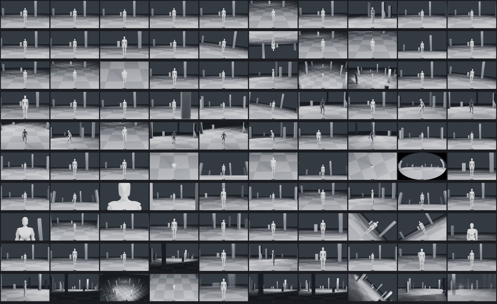

# Acheng Director (acheng-director) 🎬

<p align="center">
  
</p>

<p align="center">
  <strong>电影级导演综合引擎 · 影视工业级 AI 导演中枢 · 跨镜连续性与多模态资产管线</strong>
</p>

<p align="center">
  <a href="LICENSE"></a>
  <a href="LICENSE-DOCS.md"></a>
  <a href="SKILL.md"></a>
  <a href="https://space.bilibili.com"></a>
  
  
</p>

---

## 🌟 什么是 Acheng Director？

**Acheng Director**（技术调用标识：`acheng-director`，作者署名：`Acheng`）是一个专为现代影视制作与前沿生成式视频模型（如 **MiniMax H3**、**Seedance** 等）深度定制的**工业级电影导演综合 Agent 引擎**。

在当前的 AI 视频创作中，创作者常常遭遇诸多痛点：
- **画面飘忽与角色失真**：镜头切换后角色衣着、发型、面容剧烈变化。
- **假人木偶感与缺乏戏剧张力**：人物动作僵硬、没有真实的眼神流转、呼吸起伏与微表情变化。
- **打戏如同 PPT 拼接**：招式缺乏因果连贯性、没有真实的受力阻力、冲击停顿与动量传递。
- **运镜描述含糊不清**：提示词中充斥“慢推镜头”、“电影感”等模糊词汇，模型随机抽卡无法精准还原机位构图。
- **上下文偷工减料**：长文本生成时频繁出现“同上”、“见前段”、“根据需要自行调整”等省略性废话，破坏提示词独立可用性。

**Acheng Director 通过一套严苛的工程化契约与工业级管线，彻底解决了上述问题！**

---

## ⚡ 核心能力与技术亮点

### 1. 🎭 细腻文戏“五轨灵动表演”体系
将角色表演从单一的情绪形容词升级为可执行的五维物理行为流：
- **眼神轨迹 (`gaze`)**：视线焦点、焦点转移时钟、眼睑张力与躲闪。
- **呼吸体态 (`breath`)**：胸廓起伏、屏息停滞、喘息节奏与潜台词同步。
- **肩颈张力 (`shoulder`)**：耸肩、收缩、塌陷、防备性僵直。
- **手部肢体 (`body_hands`)**：指关节摩挲、下意识动作、重心切换、防御姿态。
- **微表情对白 (`dialogue`)**：重音节拍、嘴角微颤、吞咽咽口水、言下之意与潜台词因果链。

### 2. 🥋 硬核打戏因果链与 Combat Timing 时序
引入“**攻应果续**”严密因果逻辑体系：
- 显式声明：**施力源 (`force_source`) → 运动轨迹 (`trajectory`) → 接触受力点 (`contact`) → 阻力与冲击停顿 (`impact_hold`) → 能量传递 (`transfer`) → 反作用力后坐 (`recoil`)**。
- **时序曲线 (`speed_profile`)**：启动 (`approach`)、决意发力 (`commit`)、撞击窗口 (`contact`)、动作恢复 (`recovery`) 与重置 (`reset`)。
- **慢动作合法窗口**：精准锁定冲击接触的 0.1–0.3 秒，杜绝无意义的全程慢速漂移。

### 3. 📹 132 段镜头运动白模基准库 (`camera-moves-whitebox-132`)
- 包含推、拉、摇、移、跟、升降、环绕、穿越、俯冲、FPV、滚转等 **132 种经典运镜视差参照物视频**（1920×1080 / 24fps / 4秒）。
- 提供标准 Previs 走位白模与接触表（`contact-sheet.png`），开拍前消除一切运镜歧义，提供机器级精准的焦段与机位走位坐标。

### 4. 🔗 场景登记与跨镜连续性账本 (`continuity_ledger`)
- **场景登记本 (`scene_registry`)**：记录几何空间、出入口、光位动机、破坏痕迹与地标。
- **状态连续性账本**：跨镜头、跨场次强行锁定角色伤势变化、服饰破损、弹药消耗、道具归属权及场景损毁，杜绝跨镜“瞬时复原”或“道具穿越”。

### 5. 🛡️ 89 项工业级门禁断言与“2900 词红线法则”
- **反省略门禁**：严禁出现“同上”、“沿用前文”、“根据需要调整”，每个资产卡与每段视频提示词均具备独立可执行性。
- **2900 词上限控制**：严格适配大模型上下文输入黄金区间，避免提示词过载导致模型注意力坍塌。
- **双时长精准对齐**：视频画面时长与音频音效时长精确至 0.1 秒严丝合缝。

### 6. 🎬 MiniMax H3 影视级全模式编译与 Seedance 适配
支持 MiniMax H3 全套五种生成模式以及 Seedance 自然语言时间轴模式：
- **T2VA**：纯文生视频 + 沉浸式环境音效设计。
- **I2VA**：首帧关键帧图像 + 视频动力学驱动。
- **FL2VA**：首尾双关键帧空间插值逆推。
- **L2VA**：尾帧状态逆推起手式。
- **Ref2VA**：全资产参考图绑定，精准驱动多角色与复杂空间构图。

### 7. 🧩 4.0 薄编排层与演播室交互工作台
- 引入 `scripts/orchestrator_plan.py`、`scripts/workflow_state.py` 与 `scripts/orchestrator_commit.py`。
- 支持幂等写入、状态哈希比对、过期输入阻断与断点恢复（Partial Cursor）。
- 输出演播级可视化交付视图 `DELIVERY_VIEW.md`，资产参考图上传映射一目了然。

---

## 🏗️ 系统架构与模块总览

Acheng Director 采用**主导演单一真值中枢 + 七大专业业务模块**架构，结构清晰、权属分明：

```
acheng-director/
├── SKILL.md                          # 技能主入口定义与生产契约核心
├── 使用指南.md                        # 完整详细的用户实操指南
├── 3.5.4简便操作指南.md                # 极速上手最短路径
├── DELIVERY.md                       # 交付入口与核心规范导读
├── camera-moves-whitebox-132/        # 132 段 1080P/24fps 镜头运动白模库及接触表
│   ├── contact-sheet.png             # 132 镜头总览接触表
│   └── 01_dolly_in.mp4 ~ 132_*.mp4   # 运镜视频素材
├── modules/                          # 七大专业生产模块
│   ├── story/                        # 剧本架构、分场大纲、角色弧光、知情差与对白
│   ├── shots/                        # 分镜切镜、机位运动路径、景别、切镜承接
│   ├── performance/                  # 文戏五轨微动作微表情、打戏因果链、时序控制
│   ├── effects/                      # 特效物理、能量/流体/破坏/天气、巨构尺度双证据
│   ├── assets/                       # 角色四视图、道具卡、STYLE_MOTHER 风格母版
│   │   └── scene-design/             # 场景空间美学、环境概念图、光位与负空间
│   ├── model/                        # MiniMax H3 (5种模式) 与 Seedance 提示词编译器
│   └── continuity/                   # 跨镜连续性账本、伤势/弹药/道具权属追踪
├── scripts/                          # 核心执行、编排、审计与交付验证 Python 脚本库
│   ├── compile_h3.py                 # H3 提示词编译器
│   ├── orchestrator_plan.py          # 4.0 编排规划器
│   ├── orchestrator_commit.py        # 4.0 事务提交与门禁拦截器
│   ├── audit_storyboard_quality.py   # 89 项门禁质量审计
│   ├── director_library.py           # 36 决策卡与材质库查询工具
│   ├── delivery_integrity.py         # 交付完整性与反省略检测
│   └── reference_bindings.py         # 资产参考图绑定与联合交付工具
├── data/                             # 结构化数据库与机器索引
│   ├── camera-moves.json             # 132 运镜机器可检索元数据
│   ├── director-inquiries.json       # 36 张专业决策问题卡库
│   ├── visual-style-materials.json   # 31 个视觉材质条目与 7 种风格适配库
│   └── red-monkey-integrations.json  # 能力集成与门禁契约清单
├── templates/                        # 标准模板库 (剧本阶段、资产阶段、分镜规格等)
├── examples/                         # 八套工业级完整生产范例 (含数据、卡片与提示词)
└── reports/                          # 功能审查、包完整性与白模视频验收报告
```

---

## 🚀 快速上手与集成指南

### 1. 在 AI 智能体/编程环境中安装与调用

#### 作为 Antigravity IDE / Gemini Agent Skill
将本仓库克隆或解压至您的全局技能目录或工作区技能目录：
```powershell
# 克隆到全局技能目录（Windows 路径示例）
cd C:\Users\<YourUsername>\.gemini\config\skills
git clone https://github.com/AharaOoO/acheng-director-skill.git acheng-director
```

#### 作为 Claude Code / Cursor / Codex 技能
将仓库复制到您的 Agent skills 路径下，AI 即可在对话中自动发现或通过 `$acheng-director` 显式唤起。

---

### 2. 交互使用三步法

在对话中输入需求时，请按照以下标准范式提供输入，以获得最高质量的交付物：

```text
你是 Acheng Director。请为我的影视项目制作工业级生产卡与 MiniMax H3 提示词包：
1. 【项目目标】：制作一段赛博朋克雨夜巷战高动态动作戏（时长 14 秒）。
2. 【锁定事实】：主角身穿黑色战术风衣，左臂有机械义肢亮青色光，手持折叠电刃；对手为重装清扫机甲；场景地面有积水反射霓虹倒影。
3. 【允许原创】：机甲受损后的管线电弧爆发特效、镜头推拉机位路线。
4. 【交付要求】：调用 performance + shots + effects + model 模块，生成 Ref2VA 模式 H3 提示词，并输出独立资产提示词与逐段参考图绑定卡。反省略，严禁使用“同上”。
```

---

### 3. 命令行实用工具 (CLI Tools)

本系统不仅支持大模型调度，还提供纯 Python 标准库可运行的检验与查询脚本：

#### ① 查询专业决策问题卡或视觉材质库
```bash
# 查询 shots 模块相关的决策卡
python scripts/director_library.py questions --module shots

# 查询指定材质与媒介的视觉表现特征
python scripts/director_library.py visuals --medium cinematic --surface wet_asphalt
```

#### ② 运行 89 项门禁断言与分镜质量审计
```bash
python scripts/audit_storyboard_quality.py examples/01-mecha.production.json
```

#### ③ 校验交付完整性与反省略规则
```bash
python scripts/delivery_integrity.py output/
```

#### ④ 验证 132 段运镜白模视频文件完整性
```bash
python scripts/verify_previs_media.py
```

---

## 📚 8 套开箱即用工业级生产范例

仓库内 `examples/` 目录提供了八套跨越不同题材、媒介与时长的顶级工业范例：

| 范例名称 | 题材与特色 | 时长与分段 | 核心模式 |
| :--- | :--- | :--- | :--- |
| **01-重工业机甲** | 好莱坞重工机甲对决、受力与金属形变 | 14秒 单段完整 | MiniMax H3 (Ref2VA) |
| **02-文戏微表情** | 审讯室极致文戏对峙、五轨微动作微表情 | 20秒 两段10秒 | MiniMax H3 (I2VA/Ref2VA) |
| **03-超巨构神魔** | 宇宙级超巨物对峙、双尺度真实感证据 | 14秒 单段完整 | MiniMax H3 (Ref2VA) |
| **04-三集八线悬疑** | 复杂多线叙事、知情差追踪与伏笔回收 | 180秒 12个独立分段 | H3 批量分段 + 全资产绑定 |
| **05-纸鹤水墨动作** | 非写实水墨风格、高动态物理形变 | 36秒 三段12秒 | I2VA / FL2VA / L2VA |
| **06-2D动画电话戏** | 经典赛璐璐风格跨硬切、声画错位剪辑 | 10秒 跨切对白 | Ref2VA 跨切 |
| **07-喜剧道具误会** | 夸张节奏表演、道具反转、节奏错位 | 20秒 两段10秒 | 双段连贯交付 |
| **08-悬疑低声细语** | 声音先行 (J-Cut)、延迟倒影空间 | 10秒 首帧驱动 | I2VA 首帧驱动 |

---

## 📜 开源协议与版权声明

本仓库采用精细化分层授权方案（见 [LICENSE-SCOPE.md](LICENSE-SCOPE.md) 与 [NOTICE](NOTICE)）：

1. **代码与工程脚本 (`scripts/`)**：基于 **[Apache-2.0 License](LICENSE)** 开放，允许自由分发、修改与工程集成。
2. **创作文本、规范文档与提示词体系 (`SKILL.md`, `modules/`, `references/`, `examples/`)**：基于 **[CC BY-NC-ND 4.0](LICENSE-DOCS.md)** 授权（署名 - 非商业性使用 - 禁止演绎）。
3. **商业变现与创作者自由**：
   - **完全保护创作者权益**：由本系统编译输出的所有分镜剧本、提示词以及创作者据此生成的视频、图像衍生作品，**创作者享有完全的版权与支配权，完全允许商业变现与接单变现**！
4. **第三方材料声明**：本工程整合及引用的第三方开源材料（如 `camera-moves-whitebox` 等）均严格保留原作者 MIT License 并在 [NOTICE](NOTICE) 中明确注明来源。

---

## 🤝 贡献与致谢

- **架构设计与优化**：[B站 @Acheng琢影](https://space.bilibili.com)
- **致谢**：特别感谢开源社区在 AI 影视分镜、运镜白模与提示词工程领域的先驱探索者！
- 如果本系统对您的 AI 影视创作、接单与生产有所帮助，欢迎点亮右上角的 ⭐️ **Star** 收藏支持！
