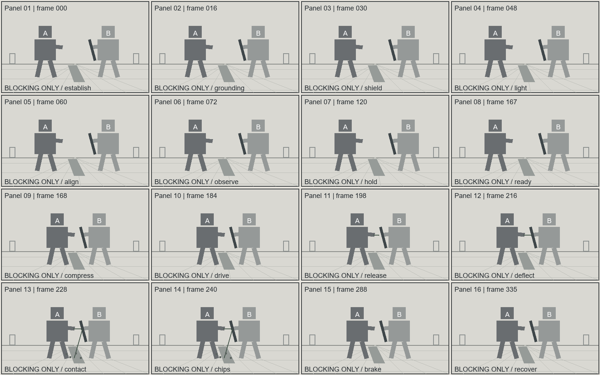

# 重工业机甲｜盾缘导流

状态：完整生产卡及提示词已编译；图像仅有随包灰模构图示意，未调用影视生成模型。

- 总时长：14 秒；最大生成窗：14 秒；24 fps。
- 数据真值源：[01-mecha.production.json](01-mecha.production.json)。
- 声音：现场音；非叙事配乐 N/A。

## 剧情与人物选择

Forge试图穿过维修沟，Ward用盾面导走能量。护盾守住通路，Forge损失一发能量，浅层地面损伤成为下一轮站位限制。

A：一次射流攻击是否突破防线。
B：防守者用退让角度取代硬顶。
C：盾缘导流机制在结果中被证明。

## 登记场景与人物

```json
{
  "scenes": [
    {
      "id": "S01",
      "name": "维修机库",
      "space": "Service trench, two human-sized doors and east-wall maintenance lamp",
      "version": "v1",
      "entrances": [
        "west service route"
      ],
      "exits": [
        "east service route"
      ],
      "landmarks": [
        "Service trench, two human-sized doors and east-wall maintenance lamp"
      ],
      "key_light": "fixed world-east source",
      "prompt_description": "The repair hangar contains a central trench, two human-sized doors and an east-wall maintenance lamp."
    }
  ],
  "characters": [
    {
      "id": "CHAR_FORGE",
      "name": "Forge",
      "height_m": 8.0,
      "identity": "Original design; appearance defined by the production prose, not by a franchise reference",
      "prompt_description": "Forge is an eight-meter bipedal machine with broad ochre shoulders, a square visor and a right-forearm emitter."
    },
    {
      "id": "CHAR_WARD",
      "name": "Ward",
      "height_m": 8.0,
      "identity": "Original design; appearance defined by the production prose, not by a franchise reference",
      "prompt_description": "Ward is an eight-meter machine with overlapping dark armor, a silver visor and a left-arm steel shield."
    }
  ]
}
```

## 逐镜生产卡

### FILM-S01-SH001｜0.000–7.000 秒

Forge stands left of the service trench; Ward stands right. The east lamp illuminates upper armor edges through localized oil haze; matte steel flats retain their shape.

```json
{
  "id": "FILM-S01-SH001",
  "scene_id": "S01",
  "start_frame": 0,
  "end_frame": 168,
  "visual": "Forge stands left of the service trench; Ward stands right. The east lamp illuminates upper armor edges through localized oil haze; matte steel flats retain their shape.",
  "camera": {
    "previs_id": "052",
    "lens_mm": 35,
    "sensor_basis": "full-frame equivalent",
    "shutter_angle": 180,
    "movement": "slow controlled push",
    "path": "straight 0.5m push from the south-side platform",
    "target": "the visible action and contact plane",
    "adaptation": "project-specific amplitude and speed; source ID is a motion-family reference",
    "description": "From the south platform, the camera slowly pushes forward half a meter, keeping both machines and the trench visible."
  },
  "characters": [
    {
      "id": "CHAR_FORGE",
      "position": [
        0.3,
        0.55
      ],
      "facing": "toward screen right",
      "gaze": "toward Ward",
      "weapon_hand": "right-forearm emitter",
      "weapon_direction": "toward the established contact line"
    },
    {
      "id": "CHAR_WARD",
      "position": [
        0.72,
        0.55
      ],
      "facing": "toward screen left",
      "gaze": "toward Forge",
      "weapon_hand": "left-arm steel shield",
      "weapon_direction": "toward the established contact line"
    }
  ],
  "features": {
    "core_emotion": false,
    "combat": false,
    "supernatural_vfx": false,
    "colossal": false
  },
  "dialogues": [],
  "audio": {
    "foley": [
      "Hydraulic pumps cycle under a steady 35 Hz motor rumble; loose floor grit clicks under the planted soles."
    ],
    "low_frequency_hz": 35,
    "classification": "audible_sub_bass",
    "source": "the established mechanical drive"
  },
  "outcome_events": [],
  "state_in": {
    "characters": {
      "CHAR_FORGE": {
        "ammo": 4,
        "trauma_phase": null
      },
      "CHAR_WARD": {
        "ammo": 0,
        "trauma_phase": null
      }
    },
    "scenes": {
      "S01": 0
    },
    "props": {
      "SHIELD": "CHAR_WARD"
    }
  },
  "state_out": {
    "characters": {
      "CHAR_FORGE": {
        "ammo": 4,
        "trauma_phase": null
      },
      "CHAR_WARD": {
        "ammo": 0,
        "trauma_phase": null
      }
    },
    "scenes": {
      "S01": 0
    },
    "props": {
      "SHIELD": "CHAR_WARD"
    }
  },
  "state_description": "Ward's shield and the supporting concrete slab are intact."
}
```

### FILM-S01-SH002｜7.000–14.000 秒

From the same safe side of the action axis, Forge brings its right forearm emitter toward Ward's raised left shield. The service doors and east-wall light retain their established positions; the trench remains between the machines.

```json
{
  "id": "FILM-S01-SH002",
  "scene_id": "S01",
  "start_frame": 168,
  "end_frame": 336,
  "visual": "From the same safe side of the action axis, Forge brings its right forearm emitter toward Ward's raised left shield. The service doors and east-wall light retain their established positions; the trench remains between the machines.",
  "camera": {
    "previs_id": "039",
    "lens_mm": 50,
    "sensor_basis": "full-frame equivalent",
    "shutter_angle": 180,
    "movement": "slow controlled lateral translation",
    "path": "one-meter eastward track, easing to a hold",
    "target": "the visible action and contact plane",
    "adaptation": "project-specific amplitude and speed; source ID is a motion-family reference",
    "description": "The camera tracks laterally one meter with the shield edge, then decelerates as the machines recover; the contact line remains unobstructed."
  },
  "characters": [
    {
      "id": "CHAR_FORGE",
      "position": [
        0.38,
        0.55
      ],
      "facing": "toward screen right",
      "gaze": "toward Ward",
      "weapon_hand": "right-forearm emitter",
      "weapon_direction": "toward the established contact line"
    },
    {
      "id": "CHAR_WARD",
      "position": [
        0.66,
        0.55
      ],
      "facing": "toward screen left",
      "gaze": "toward Forge",
      "weapon_hand": "left-arm steel shield",
      "weapon_direction": "toward the established contact line"
    }
  ],
  "features": {
    "core_emotion": false,
    "combat": true,
    "supernatural_vfx": true,
    "colossal": false
  },
  "dialogues": [],
  "audio": {
    "foley": [
      "A short metal resonance follows the visible movement."
    ],
    "low_frequency_hz": 35,
    "classification": "audible_sub_bass",
    "source": "the established mechanical drive"
  },
  "outcome_events": [
    "EV_FIRE",
    "EV_SCRAPE"
  ],
  "state_in": {
    "characters": {
      "CHAR_FORGE": {
        "ammo": 4,
        "trauma_phase": null
      },
      "CHAR_WARD": {
        "ammo": 0,
        "trauma_phase": null
      }
    },
    "scenes": {
      "S01": 0
    },
    "props": {
      "SHIELD": "CHAR_WARD"
    }
  },
  "state_out": {
    "characters": {
      "CHAR_FORGE": {
        "ammo": 3,
        "trauma_phase": null
      },
      "CHAR_WARD": {
        "ammo": 0,
        "trauma_phase": null
      }
    },
    "scenes": {
      "S01": 1
    },
    "props": {
      "SHIELD": "CHAR_WARD"
    }
  },
  "combat": {
    "force_source": "Forge loads its left sole, rotates its hip frame and drives the right shoulder forward.",
    "trajectory": "The forearm follows a short forward arc toward the shield's upper outside edge.",
    "contact": "The emitted stream meets the shield's beveled metal edge.",
    "resistance": "Overlapping shield plates resist the impact and guide its direction downward.",
    "impact_hold": "At the contact beat, the shield silhouette stays readable for two planned frames while dust continues moving.",
    "transfer": "The shield retracts into Ward's shoulder damper; its rear sole slides along the floor.",
    "recoil": "Forge's elbow folds back as its planted left foot absorbs the emitter's recoil.",
    "chain": {
      "attack": "Forge releases one charge toward the raised shield.",
      "response": "Ward turns its hip and angles the shield to deflect the stream.",
      "result": "The charge scrapes the concrete surface, leaving grit and a shallow scar without breaking the supporting slab.",
      "continuation": "Ward keeps its shield forward; Forge resets its forearm with one fewer charge available."
    },
    "timing": {
      "axis_lock": "Keep the established left-right axis: the attacker remains on screen left and the defender on screen right; do not cross the 180-degree line during the exchange.",
      "spatial_direction": "Forge's emitter travels from screen left toward Ward's shield on screen right; Ward's deflection turns the result down toward the trench, never back through Forge.",
      "speed_curve": "Use fast readable approach, a brief compressed commitment, a precisely readable contact beat, then a longer real-time recovery; never insert a decorative slow-motion pause between unrelated actions.",
      "camera_sync": "The camera tracks parallel to the action line, keeps the feet, weapon path and contact plane visible, and eases only after the defender's result is readable.",
      "direction_facts": {
        "origin": "The attack begins at the declared planted foot, hand or mounted weapon.",
        "target": "The declared defender or environmental target receives the action.",
        "screen_direction": "Forge's emitter travels from screen left toward Ward's shield on screen right; Ward's deflection turns the result down toward the trench, never back through Forge.",
        "body_orientation": "The attacker faces the target and the defender faces the attacker without an unexplained turn.",
        "weapon_direction": "The active limb, weapon or emitted object follows the declared contact line.",
        "support_point": "The declared planted foot, hand, ground or structural brace carries the force.",
        "result_direction": "The result travels along the declared deflection, recoil or displacement line."
      },
      "speed_profile": {
        "support": "Establish the planted support and readable distance before acceleration.",
        "acceleration": "Accelerate from the support through the body into the weapon or action path.",
        "contact_read": "Compress only the single contact and first material response so the force direction is readable.",
        "recovery": "Return to real time for recoil, displacement, braking and the inherited tail state."
      },
      "phases": [
        {
          "name": "approach",
          "start": 0,
          "end": 24,
          "playback": "real_time",
          "purpose": "the planted support and target line must be established before acceleration",
          "motion": "the attacker compresses the support leg and the defender raises the readable defense without changing sides",
          "positions": "The attacker remains on screen left and the defender on screen right during the approach beat, with the established landmark visible.",
          "orientation": "The attacker faces the defender and the defender faces the attacker throughout approach; both gazes stay on the active line.",
          "action": "The approach action follows the declared support, target and result direction without a teleport or axis flip.",
          "combat_logic": {
            "attacker": "The registered attacker or its active weapon owns this beat.",
            "target": "The registered defender or stated environmental target receives the action.",
            "target_point": "The declared contact surface or target point remains specific and visible.",
            "intent": "The tactical purpose is to complete the approach beat of the exchange.",
            "defender_state": "The defender begins from the inherited balance, guard and support state.",
            "response": "The defender responds along the declared line with a visible physical cause.",
            "result": "The immediate approach result is visible before the next phase begins.",
            "next_authority": "The next phase starts from this held pose and its stated active side."
          },
          "camera": {
            "framing": "The camera framing keeps both bodies, the active line and the approach anchor readable.",
            "movement": "The camera uses a controlled approach movement with amplitude and speed matched to the action.",
            "motion_vector": "The camera vector supports the declared attack, defense and result vectors without crossing the axis.",
            "action_anchor": "The camera follows the visible approach anchor: support, weapon path, contact, recoil or settled guard."
          },
          "dof": "Focus stays on the approach anchor and transfers only when the next physical result becomes readable.",
          "composition": "The left-right axis, depth landmark and protected movement exit remain visible.",
          "dynamics": "Environmental response remains subordinate during approach and follows the same force direction.",
          "tail_frame": "The approach phase ends with an explicit inherited distance, facing, weapon state and gaze."
        },
        {
          "name": "commit",
          "start": 24,
          "end": 60,
          "playback": "ramped",
          "purpose": "the attack must gain speed from a visible body-driven initiation",
          "motion": "the hip and shoulder drive the weapon or energy from screen left toward the defender's stated target point",
          "positions": "The attacker remains on screen left and the defender on screen right during the commitment beat, with the established landmark visible.",
          "orientation": "The attacker faces the defender and the defender faces the attacker throughout commitment; both gazes stay on the active line.",
          "action": "The commitment action follows the declared support, target and result direction without a teleport or axis flip.",
          "combat_logic": {
            "attacker": "The registered attacker or its active weapon owns this beat.",
            "target": "The registered defender or stated environmental target receives the action.",
            "target_point": "The declared contact surface or target point remains specific and visible.",
            "intent": "The tactical purpose is to complete the commitment beat of the exchange.",
            "defender_state": "The defender begins from the inherited balance, guard and support state.",
            "response": "The defender responds along the declared line with a visible physical cause.",
            "result": "The immediate commitment result is visible before the next phase begins.",
            "next_authority": "The next phase starts from this held pose and its stated active side."
          },
          "camera": {
            "framing": "The camera framing keeps both bodies, the active line and the commitment anchor readable.",
            "movement": "The camera uses a controlled commitment movement with amplitude and speed matched to the action.",
            "motion_vector": "The camera vector supports the declared attack, defense and result vectors without crossing the axis.",
            "action_anchor": "The camera follows the visible commitment anchor: support, weapon path, contact, recoil or settled guard."
          },
          "dof": "Focus stays on the commitment anchor and transfers only when the next physical result becomes readable.",
          "composition": "The left-right axis, depth landmark and protected movement exit remain visible.",
          "dynamics": "Environmental response remains subordinate during commitment and follows the same force direction.",
          "tail_frame": "The commitment phase ends with an explicit inherited distance, facing, weapon state and gaze."
        },
        {
          "name": "contact",
          "start": 60,
          "end": 62,
          "playback": "slow_motion",
          "purpose": "the contact surface, direction of deflection and first material response must be legible",
          "motion": "the leading edge meets the defense, holds its silhouette for two frames, and begins to turn along the deflection plane",
          "positions": "The attacker remains on screen left and the defender on screen right during the contact beat, with the established landmark visible.",
          "orientation": "The attacker faces the defender and the defender faces the attacker throughout contact; both gazes stay on the active line.",
          "action": "The contact action follows the declared support, target and result direction without a teleport or axis flip.",
          "combat_logic": {
            "attacker": "The registered attacker or its active weapon owns this beat.",
            "target": "The registered defender or stated environmental target receives the action.",
            "target_point": "The declared contact surface or target point remains specific and visible.",
            "intent": "The tactical purpose is to complete the contact beat of the exchange.",
            "defender_state": "The defender begins from the inherited balance, guard and support state.",
            "response": "The defender responds along the declared line with a visible physical cause.",
            "result": "The immediate contact result is visible before the next phase begins.",
            "next_authority": "The next phase starts from this held pose and its stated active side."
          },
          "camera": {
            "framing": "The camera framing keeps both bodies, the active line and the contact anchor readable.",
            "movement": "The camera uses a controlled contact movement with amplitude and speed matched to the action.",
            "motion_vector": "The camera vector supports the declared attack, defense and result vectors without crossing the axis.",
            "action_anchor": "The camera follows the visible contact anchor: support, weapon path, contact, recoil or settled guard."
          },
          "dof": "Focus stays on the contact anchor and transfers only when the next physical result becomes readable.",
          "composition": "The left-right axis, depth landmark and protected movement exit remain visible.",
          "dynamics": "Environmental response remains subordinate during contact and follows the same force direction.",
          "tail_frame": "The contact phase ends with an explicit inherited distance, facing, weapon state and gaze."
        },
        {
          "name": "recovery",
          "start": 62,
          "end": 120,
          "playback": "real_time",
          "purpose": "the result must propagate through both bodies and the environment",
          "motion": "the defender yields along the declared line while the attacker absorbs recoil instead of teleporting to a new stance",
          "positions": "The attacker remains on screen left and the defender on screen right during the recovery beat, with the established landmark visible.",
          "orientation": "The attacker faces the defender and the defender faces the attacker throughout recovery; both gazes stay on the active line.",
          "action": "The recovery action follows the declared support, target and result direction without a teleport or axis flip.",
          "combat_logic": {
            "attacker": "The registered attacker or its active weapon owns this beat.",
            "target": "The registered defender or stated environmental target receives the action.",
            "target_point": "The declared contact surface or target point remains specific and visible.",
            "intent": "The tactical purpose is to complete the recovery beat of the exchange.",
            "defender_state": "The defender begins from the inherited balance, guard and support state.",
            "response": "The defender responds along the declared line with a visible physical cause.",
            "result": "The immediate recovery result is visible before the next phase begins.",
            "next_authority": "The next phase starts from this held pose and its stated active side."
          },
          "camera": {
            "framing": "The camera framing keeps both bodies, the active line and the recovery anchor readable.",
            "movement": "The camera uses a controlled recovery movement with amplitude and speed matched to the action.",
            "motion_vector": "The camera vector supports the declared attack, defense and result vectors without crossing the axis.",
            "action_anchor": "The camera follows the visible recovery anchor: support, weapon path, contact, recoil or settled guard."
          },
          "dof": "Focus stays on the recovery anchor and transfers only when the next physical result becomes readable.",
          "composition": "The left-right axis, depth landmark and protected movement exit remain visible.",
          "dynamics": "Environmental response remains subordinate during recovery and follows the same force direction.",
          "tail_frame": "The recovery phase ends with an explicit inherited distance, facing, weapon state and gaze."
        },
        {
          "name": "reset",
          "start": 120,
          "end": 168,
          "playback": "real_time",
          "purpose": "the next beat needs a stable inherited distance and active side",
          "motion": "both bodies settle into the declared tail state with weapons, feet and gaze still aligned",
          "positions": "The attacker remains on screen left and the defender on screen right during the reset beat, with the established landmark visible.",
          "orientation": "The attacker faces the defender and the defender faces the attacker throughout reset; both gazes stay on the active line.",
          "action": "The reset action follows the declared support, target and result direction without a teleport or axis flip.",
          "combat_logic": {
            "attacker": "The registered attacker or its active weapon owns this beat.",
            "target": "The registered defender or stated environmental target receives the action.",
            "target_point": "The declared contact surface or target point remains specific and visible.",
            "intent": "The tactical purpose is to complete the reset beat of the exchange.",
            "defender_state": "The defender begins from the inherited balance, guard and support state.",
            "response": "The defender responds along the declared line with a visible physical cause.",
            "result": "The immediate reset result is visible before the next phase begins.",
            "next_authority": "The next phase starts from this held pose and its stated active side."
          },
          "camera": {
            "framing": "The camera framing keeps both bodies, the active line and the reset anchor readable.",
            "movement": "The camera uses a controlled reset movement with amplitude and speed matched to the action.",
            "motion_vector": "The camera vector supports the declared attack, defense and result vectors without crossing the axis.",
            "action_anchor": "The camera follows the visible reset anchor: support, weapon path, contact, recoil or settled guard."
          },
          "dof": "Focus stays on the reset anchor and transfers only when the next physical result becomes readable.",
          "composition": "The left-right axis, depth landmark and protected movement exit remain visible.",
          "dynamics": "Environmental response remains subordinate during reset and follows the same force direction.",
          "tail_frame": "The reset phase ends with an explicit inherited distance, facing, weapon state and gaze."
        }
      ],
      "slow_motion": {
        "enabled": true,
        "start": 60,
        "end": 62,
        "rate": 0.5,
        "trigger": "the weapon or energy visibly reaches the defense surface",
        "reason": "the audience must read the single contact and deflection rather than a generic flash",
        "exit": "restore real-time motion immediately after the contact silhouette and first material response are clear"
      }
    }
  },
  "vfx": {
    "origin": "Forge's registered right forearm emitter",
    "backbone": "A narrow plasma fluid stream remains continuously attached to the forearm nozzle, folding along the shield bevel before reaching the floor.",
    "collision_type": "impact",
    "collision": "The stream grazes the concrete top layer; only its surface chips detach.",
    "particles": {
      "solid": {
        "present": true,
        "description": "Small concrete chips travel outward from the grazing line and fall into the trench."
      },
      "gas": {
        "present": true,
        "description": "A thin dust sheet expands close to the floor and thins behind the machines."
      },
      "emissive": {
        "present": true,
        "description": "Brief orange sparks peel from the shield's contact edge and fade before reaching the doors."
      }
    },
    "lighting": "The bright contact core occupies a narrow strip; soft amber spill stays local while the east-wall lamp continues to define the armor planes.",
    "phases": [
      {
        "name": "anticipation",
        "start": 0,
        "end": 24
      },
      {
        "name": "release",
        "start": 24,
        "end": 60
      },
      {
        "name": "impact",
        "start": 60,
        "end": 62
      },
      {
        "name": "decay",
        "start": 62,
        "end": 168
      }
    ]
  },
  "state_description": "Ward's shield and the supporting concrete slab are intact."
}
```

## GPT Image 2 / 2.5 可直接复制提示词

按主体、媒介、构图、光材、密度、受控细节、当前风险顺序编译。执行尺寸和采样设置留给实际出图入口。

参考图：必须上传下列文件；只继承明确列出的用途。

- Reference image 1：[上传该图](media/mecha-contact.png)；用途：composition；保留：only Panel 01's left-right placement and ground line; the left block marked A denotes Forge, and the right block marked B denotes Ward；不继承：the grid, letters, panel numbers, gray block anatomy and flat diagram shading; produce one full-frame image。

```text
Reference image 1 supplies composition guidance for the confrontation between Forge and Ward. Preserve only Panel 01's left-right placement and ground line; the left block marked A denotes Forge, and the right block marked B denotes Ward. Do not inherit the grid, letters, panel numbers, gray block anatomy and flat diagram shading; produce one full-frame image.

Create one live-action mechanical confrontation frame inside the repair hangar: Forge at left with broad ochre shoulder plates and square visor, Ward at right with overlapping dark plates and silver visor, its left shield facing Forge's right forearm emitter. Preserve both eight-meter body proportions, the service trench between them, the two human-sized doors and the world-east maintenance lamp. Use a 35 mm equivalent view from the south platform with both soles and the shield contact plane visible. Painted steel stays matte across broad panels, worn shield edges show narrow metal highlights, and ceramic joints remain darker with visible thickness. The east lamp passes through localized oil haze onto the upper armor edges, with weak concrete bounce preserving the shadow-side structure. Concentrate detail at the shield bevel and actuator joints; combine distant trusses into broad quiet forms. Avoid disconnected joints, tiled micro-panels and uniform plastic gloss.
```

## MECHA_SEG01｜16格逐项映射



灰模不代表最终外貌、材质或准确摄影轨迹。

| Panel | Shot | 全局帧 | 单相位 |
|---|---|---:|---|
| 01 | FILM-S01-SH001 | 0 | Both units and the trench are established. |
| 02 | FILM-S01-SH001 | 16 | Forge keeps its left sole planted. |
| 03 | FILM-S01-SH001 | 30 | Ward presents the left shield. |
| 04 | FILM-S01-SH001 | 48 | The east lamp separates the armor planes. |
| 05 | FILM-S01-SH001 | 60 | Forge aligns its forearm with the shield edge. |
| 06 | FILM-S01-SH001 | 72 | Ward watches the aligned nozzle. |
| 07 | FILM-S01-SH001 | 120 | Both positions remain on the established sides. |
| 08 | FILM-S01-SH001 | 167 | The nozzle and shield line are ready. |
| 09 | FILM-S01-SH002 | 168 | Forge compresses the left leg suspension. |
| 10 | FILM-S01-SH002 | 184 | The right shoulder starts the forward drive. |
| 11 | FILM-S01-SH002 | 198 | The emitter stream extends from the nozzle. |
| 12 | FILM-S01-SH002 | 216 | Ward rotates the shield bevel downward. |
| 13 | FILM-S01-SH002 | 228 | The stream reaches the readable contact edge. |
| 14 | FILM-S01-SH002 | 240 | Deflected energy chips the floor surface. |
| 15 | FILM-S01-SH002 | 288 | Ward brakes through the rear sole. |
| 16 | FILM-S01-SH002 | 335 | Forge recovers the arm with a spent charge. |

## MECHA_SEG01｜H3 Ref2VA 完整提示词

```text
subject_definitions:
<Picture 1> is the sixteen-panel gray blocking diagram for [Shot 1] and [Shot 2], providing left-right placement and event order; its schematic figures and flat shading are not appearance or material references.

summary:
[reference generation] The target video follows the blocking and order in <Picture 1>, first establishing the confrontation and then showing the attack, defense, material response and continuing recovery.

retention_analysis:
<Picture 1> (planning reference for [Shot 1] and [Shot 2]): weak_reference - preserve the two figures' relative sides and the ordered action beats, while replacing schematic blocks with the described original character designs in a single full-screen view.

detailed_description:
The video uses grounded live-action mechanical rendering with distinct painted steel and matte ceramic surfaces.
This is a self-contained production instruction and must be readable without the production file, an earlier segment, or a hidden character bible. For every shot, explicitly state: the medium and visible subject appearance, screen position and facing; the current environment, landmarks and light direction; the exact starting pose, prop ownership, contact points and state; the factual trigger for each change; the chronological action, reaction and physical consequence; the camera framing, lens, movement type, direction, path, amplitude, speed and target; the source and timing of dialogue, foley, room tone and breath; the exact held state at the end and what can continue into the next shot. Render objective, social strategy and subtext as observable gaze, breath, posture, hand, facial and voice behavior. Keep cause and effect physically, spatially, temporally and socially coherent. Do not replace a visible action with a vague adjective, skip the transition between beats, collapse preparation, accent, follow-through or settle into one verb, or invent dialogue, objects, voices, cuts or state changes that are not written below.
[Shot 1] Write this shot as a complete independent instruction: restate who is visible and where they are, the environment and light, the start state, the trigger, the ordered action and reaction, the camera path and speed, synchronized sound, and the resulting held state. Forge is an eight-meter bipedal machine with broad ochre shoulders, a square visor and a right-forearm emitter. Ward is an eight-meter machine with overlapping dark armor, a silver visor and a left-arm steel shield. The repair hangar contains a central trench, two human-sized doors and an east-wall maintenance lamp. At the start of this shot: Ward's shield and the supporting concrete slab are intact. From 0.000 to 7.000 seconds of this request, <Picture 1> is the sixteen-panel gray blocking diagram for [Shot 1] and [Shot 2], providing left-right placement and event order; its schematic figures and flat shading are not appearance or material references. Preserve only: <Picture 1> (planning reference for [Shot 1] and [Shot 2]): weak_reference - preserve the two figures' relative sides and the ordered action beats, while replacing schematic blocks with the described original character designs in a single full-screen view.. Forge stands left of the service trench; Ward stands right. The east lamp illuminates upper armor edges through localized oil haze; matte steel flats retain their shape. From the south platform, the camera slowly pushes forward half a meter, keeping both machines and the trench visible. The camera uses a 35 mm lens under the full-frame equivalent convention, with a 180-degree shutter-angle convention; movement: slow controlled push; path: straight 0.5m push from the south-side platform; target: the visible action and contact plane. At shot entry, Forge has normalized screen anchor x=0.3, y=0.55 (left-to-right and top-to-bottom); facing toward screen right; gaze toward Ward; hand or weapon state: right-forearm emitter; weapon direction or absence: toward the established contact line. At shot entry, Ward has normalized screen anchor x=0.72, y=0.55 (left-to-right and top-to-bottom); facing toward screen left; gaze toward Forge; hand or weapon state: left-arm steel shield; weapon direction or absence: toward the established contact line. Hydraulic pumps cycle under a steady 35 Hz motor rumble; loose floor grit clicks under the planted soles. The designed low-frequency cue is 35 Hz, sourced from the established mechanical drive. The shot develops the blocking in <Picture 1> Panels 01–08. At the end of this shot, carry forward these recorded constraints: Forge retains 4 recorded ammunition or energy units; the steel shield remains with Ward.
[Shot 2] At 00:07.000, the camera cuts to the following view. Write this shot as a complete independent instruction: restate who is visible and where they are, the environment and light, the start state, the trigger, the ordered action and reaction, the camera path and speed, synchronized sound, and the resulting held state. Forge is an eight-meter bipedal machine with broad ochre shoulders, a square visor and a right-forearm emitter. Ward is an eight-meter machine with overlapping dark armor, a silver visor and a left-arm steel shield. The repair hangar contains a central trench, two human-sized doors and an east-wall maintenance lamp. At the start of this shot: Ward's shield and the supporting concrete slab are intact. From 7.000 to 14.000 seconds of this request, <Picture 1> is the sixteen-panel gray blocking diagram for [Shot 1] and [Shot 2], providing left-right placement and event order; its schematic figures and flat shading are not appearance or material references. Preserve only: <Picture 1> (planning reference for [Shot 1] and [Shot 2]): weak_reference - preserve the two figures' relative sides and the ordered action beats, while replacing schematic blocks with the described original character designs in a single full-screen view.. From the same safe side of the action axis, Forge brings its right forearm emitter toward Ward's raised left shield. The service doors and east-wall light retain their established positions; the trench remains between the machines. The camera tracks laterally one meter with the shield edge, then decelerates as the machines recover; the contact line remains unobstructed. The camera uses a 50 mm lens under the full-frame equivalent convention, with a 180-degree shutter-angle convention; movement: slow controlled lateral translation; path: one-meter eastward track, easing to a hold; target: the visible action and contact plane. At shot entry, Forge has normalized screen anchor x=0.38, y=0.55 (left-to-right and top-to-bottom); facing toward screen right; gaze toward Ward; hand or weapon state: right-forearm emitter; weapon direction or absence: toward the established contact line. At shot entry, Ward has normalized screen anchor x=0.66, y=0.55 (left-to-right and top-to-bottom); facing toward screen left; gaze toward Forge; hand or weapon state: left-arm steel shield; weapon direction or absence: toward the established contact line. Forge loads its left sole, rotates its hip frame and drives the right shoulder forward. Forge releases one charge toward the raised shield. The forearm follows a short forward arc toward the shield's upper outside edge. Ward turns its hip and angles the shield to deflect the stream. The emitted stream meets the shield's beveled metal edge. Overlapping shield plates resist the impact and guide its direction downward. At the contact beat, the shield silhouette stays readable for two planned frames while dust continues moving. The shield retracts into Ward's shoulder damper; its rear sole slides along the floor. Forge's registered right forearm emitter A narrow plasma fluid stream remains continuously attached to the forearm nozzle, folding along the shield bevel before reaching the floor. Small concrete chips travel outward from the grazing line and fall into the trench. A thin dust sheet expands close to the floor and thins behind the machines. Brief orange sparks peel from the shield's contact edge and fade before reaching the doors. The stream grazes the concrete top layer; only its surface chips detach. The bright contact core occupies a narrow strip; soft amber spill stays local while the east-wall lamp continues to define the armor planes. Within this shot, the effect follows anticipation 0.000–1.000s; release 1.000–2.500s; impact 2.500–2.583s; decay 2.583–7.000s. The charge scrapes the concrete surface, leaving grit and a shallow scar without breaking the supporting slab. Forge's elbow folds back as its planted left foot absorbs the emitter's recoil. Ward keeps its shield forward; Forge resets its forearm with one fewer charge available. Combat direction lock: Keep the established left-right axis: the attacker remains on screen left and the defender on screen right; do not cross the 180-degree line during the exchange. Spatial direction: Forge's emitter travels from screen left toward Ward's shield on screen right; Ward's deflection turns the result down toward the trench, never back through Forge. Speed curve: Use fast readable approach, a brief compressed commitment, a precisely readable contact beat, then a longer real-time recovery; never insert a decorative slow-motion pause between unrelated actions. Camera and action synchronization: The camera tracks parallel to the action line, keeps the feet, weapon path and contact plane visible, and eases only after the defender's result is readable. Direction facts: origin = The attack begins at the declared planted foot, hand or mounted weapon; target = The declared defender or environmental target receives the action; screen direction = Forge's emitter travels from screen left toward Ward's shield on screen right; Ward's deflection turns the result down toward the trench, never back through Forge; body orientation = The attacker faces the target and the defender faces the attacker without an unexplained turn; weapon direction = The active limb, weapon or emitted object follows the declared contact line; support point = The declared planted foot, hand, ground or structural brace carries the force; result direction = The result travels along the declared deflection, recoil or displacement line. Speed profile: support = Establish the planted support and readable distance before acceleration; acceleration = Accelerate from the support through the body into the weapon or action path; contact read = Compress only the single contact and first material response so the force direction is readable; recovery = Return to real time for recoil, displacement, braking and the inherited tail state. From 0.000 to 1.000 seconds, the approach phase uses real_time playback because the planted support and target line must be established before acceleration; motion: the attacker compresses the support leg and the defender raises the readable defense without changing sides. Positions: The attacker remains on screen left and the defender on screen right during the approach beat, with the established landmark visible. Orientation: The attacker faces the defender and the defender faces the attacker throughout approach; both gazes stay on the active line. Action: The approach action follows the declared support, target and result direction without a teleport or axis flip. Combat logic: attacker The registered attacker or its active weapon owns this beat; target The registered defender or stated environmental target receives the action; target point The declared contact surface or target point remains specific and visible; intent The tactical purpose is to complete the approach beat of the exchange; defender starts The defender begins from the inherited balance, guard and support state; response The defender responds along the declared line with a visible physical cause; result The immediate approach result is visible before the next phase begins; next authority The next phase starts from this held pose and its stated active side. Camera framing: The camera framing keeps both bodies, the active line and the approach anchor readable; movement: The camera uses a controlled approach movement with amplitude and speed matched to the action; motion vector: The camera vector supports the declared attack, defense and result vectors without crossing the axis; action anchor: The camera follows the visible approach anchor: support, weapon path, contact, recoil or settled guard. DOF: Focus stays on the approach anchor and transfers only when the next physical result becomes readable. Composition: The left-right axis, depth landmark and protected movement exit remain visible. Dynamics: Environmental response remains subordinate during approach and follows the same force direction. Tail frame: The approach phase ends with an explicit inherited distance, facing, weapon state and gaze. From 1.000 to 2.500 seconds, the commit phase uses ramped playback because the attack must gain speed from a visible body-driven initiation; motion: the hip and shoulder drive the weapon or energy from screen left toward the defender's stated target point. Positions: The attacker remains on screen left and the defender on screen right during the commitment beat, with the established landmark visible. Orientation: The attacker faces the defender and the defender faces the attacker throughout commitment; both gazes stay on the active line. Action: The commitment action follows the declared support, target and result direction without a teleport or axis flip. Combat logic: attacker The registered attacker or its active weapon owns this beat; target The registered defender or stated environmental target receives the action; target point The declared contact surface or target point remains specific and visible; intent The tactical purpose is to complete the commitment beat of the exchange; defender starts The defender begins from the inherited balance, guard and support state; response The defender responds along the declared line with a visible physical cause; result The immediate commitment result is visible before the next phase begins; next authority The next phase starts from this held pose and its stated active side. Camera framing: The camera framing keeps both bodies, the active line and the commitment anchor readable; movement: The camera uses a controlled commitment movement with amplitude and speed matched to the action; motion vector: The camera vector supports the declared attack, defense and result vectors without crossing the axis; action anchor: The camera follows the visible commitment anchor: support, weapon path, contact, recoil or settled guard. DOF: Focus stays on the commitment anchor and transfers only when the next physical result becomes readable. Composition: The left-right axis, depth landmark and protected movement exit remain visible. Dynamics: Environmental response remains subordinate during commitment and follows the same force direction. Tail frame: The commitment phase ends with an explicit inherited distance, facing, weapon state and gaze. From 2.500 to 2.583 seconds, the contact phase uses slow_motion playback because the contact surface, direction of deflection and first material response must be legible; motion: the leading edge meets the defense, holds its silhouette for two frames, and begins to turn along the deflection plane. Positions: The attacker remains on screen left and the defender on screen right during the contact beat, with the established landmark visible. Orientation: The attacker faces the defender and the defender faces the attacker throughout contact; both gazes stay on the active line. Action: The contact action follows the declared support, target and result direction without a teleport or axis flip. Combat logic: attacker The registered attacker or its active weapon owns this beat; target The registered defender or stated environmental target receives the action; target point The declared contact surface or target point remains specific and visible; intent The tactical purpose is to complete the contact beat of the exchange; defender starts The defender begins from the inherited balance, guard and support state; response The defender responds along the declared line with a visible physical cause; result The immediate contact result is visible before the next phase begins; next authority The next phase starts from this held pose and its stated active side. Camera framing: The camera framing keeps both bodies, the active line and the contact anchor readable; movement: The camera uses a controlled contact movement with amplitude and speed matched to the action; motion vector: The camera vector supports the declared attack, defense and result vectors without crossing the axis; action anchor: The camera follows the visible contact anchor: support, weapon path, contact, recoil or settled guard. DOF: Focus stays on the contact anchor and transfers only when the next physical result becomes readable. Composition: The left-right axis, depth landmark and protected movement exit remain visible. Dynamics: Environmental response remains subordinate during contact and follows the same force direction. Tail frame: The contact phase ends with an explicit inherited distance, facing, weapon state and gaze. From 2.583 to 5.000 seconds, the recovery phase uses real_time playback because the result must propagate through both bodies and the environment; motion: the defender yields along the declared line while the attacker absorbs recoil instead of teleporting to a new stance. Positions: The attacker remains on screen left and the defender on screen right during the recovery beat, with the established landmark visible. Orientation: The attacker faces the defender and the defender faces the attacker throughout recovery; both gazes stay on the active line. Action: The recovery action follows the declared support, target and result direction without a teleport or axis flip. Combat logic: attacker The registered attacker or its active weapon owns this beat; target The registered defender or stated environmental target receives the action; target point The declared contact surface or target point remains specific and visible; intent The tactical purpose is to complete the recovery beat of the exchange; defender starts The defender begins from the inherited balance, guard and support state; response The defender responds along the declared line with a visible physical cause; result The immediate recovery result is visible before the next phase begins; next authority The next phase starts from this held pose and its stated active side. Camera framing: The camera framing keeps both bodies, the active line and the recovery anchor readable; movement: The camera uses a controlled recovery movement with amplitude and speed matched to the action; motion vector: The camera vector supports the declared attack, defense and result vectors without crossing the axis; action anchor: The camera follows the visible recovery anchor: support, weapon path, contact, recoil or settled guard. DOF: Focus stays on the recovery anchor and transfers only when the next physical result becomes readable. Composition: The left-right axis, depth landmark and protected movement exit remain visible. Dynamics: Environmental response remains subordinate during recovery and follows the same force direction. Tail frame: The recovery phase ends with an explicit inherited distance, facing, weapon state and gaze. From 5.000 to 7.000 seconds, the reset phase uses real_time playback because the next beat needs a stable inherited distance and active side; motion: both bodies settle into the declared tail state with weapons, feet and gaze still aligned. Positions: The attacker remains on screen left and the defender on screen right during the reset beat, with the established landmark visible. Orientation: The attacker faces the defender and the defender faces the attacker throughout reset; both gazes stay on the active line. Action: The reset action follows the declared support, target and result direction without a teleport or axis flip. Combat logic: attacker The registered attacker or its active weapon owns this beat; target The registered defender or stated environmental target receives the action; target point The declared contact surface or target point remains specific and visible; intent The tactical purpose is to complete the reset beat of the exchange; defender starts The defender begins from the inherited balance, guard and support state; response The defender responds along the declared line with a visible physical cause; result The immediate reset result is visible before the next phase begins; next authority The next phase starts from this held pose and its stated active side. Camera framing: The camera framing keeps both bodies, the active line and the reset anchor readable; movement: The camera uses a controlled reset movement with amplitude and speed matched to the action; motion vector: The camera vector supports the declared attack, defense and result vectors without crossing the axis; action anchor: The camera follows the visible reset anchor: support, weapon path, contact, recoil or settled guard. DOF: Focus stays on the reset anchor and transfers only when the next physical result becomes readable. Composition: The left-right axis, depth landmark and protected movement exit remain visible. Dynamics: Environmental response remains subordinate during reset and follows the same force direction. Tail frame: The reset phase ends with an explicit inherited distance, facing, weapon state and gaze. Use slow motion only from 2.500 to 2.583 seconds at 0.5x: trigger it when the weapon or energy visibly reaches the defense surface, because the audience must read the single contact and deflection rather than a generic flash; exit when restore real-time motion immediately after the contact silhouette and first material response are clear. A short metal resonance follows the visible movement. The designed low-frequency cue is 35 Hz, sourced from the established mechanical drive. The shot develops the blocking in <Picture 1> Panels 09–16. At local shot time 00:01.542, the recorded state change is: One registered emitter charge is released. At local shot time 00:02.500, the recorded state change is: The deflected charge chips only the floor surface. At the end of this shot, carry forward these recorded constraints: Forge retains 3 recorded ammunition or energy units; the repair hangar retains surface damage; the steel shield remains with Ward.

overall_soundscape:
A steady 35 Hz mechanical rumble underlies hydraulic hisses, shield scraping and concrete chips landing inside the trench. The hangar gives each impact a short metallic tail.

non_diegetic_music:
N/A
```

## 场记末尾回写

```json
{
  "initial": {
    "characters": {
      "CHAR_FORGE": {
        "ammo": 4,
        "trauma_phase": null
      },
      "CHAR_WARD": {
        "ammo": 0,
        "trauma_phase": null
      }
    },
    "scenes": {
      "S01": 0
    },
    "props": {
      "SHIELD": "CHAR_WARD"
    }
  },
  "events": [
    {
      "id": "EV_FIRE",
      "frame": 205,
      "shot_id": "FILM-S01-SH002",
      "domain": "ammo",
      "target": "CHAR_FORGE",
      "before": 4,
      "after": 3,
      "delta": -1,
      "reason": "One registered emitter charge is released."
    },
    {
      "id": "EV_SCRAPE",
      "frame": 228,
      "shot_id": "FILM-S01-SH002",
      "domain": "damage",
      "target": "S01",
      "before": 0,
      "after": 1,
      "reason": "The deflected charge chips only the floor surface."
    }
  ],
  "final": {
    "characters": {
      "CHAR_FORGE": {
        "ammo": 3,
        "trauma_phase": null
      },
      "CHAR_WARD": {
        "ammo": 0,
        "trauma_phase": null
      }
    },
    "scenes": {
      "S01": 1
    },
    "props": {
      "SHIELD": "CHAR_WARD"
    }
  }
}
```

## 结果验收

运行 audit_storyboard_quality.py 检查当前数据。实际生成后逐帧看身份、接触、主光、伤势和道具；音轨核对对白与频谱。未生成时视觉及声学实测保持 UNVERIFIED。
