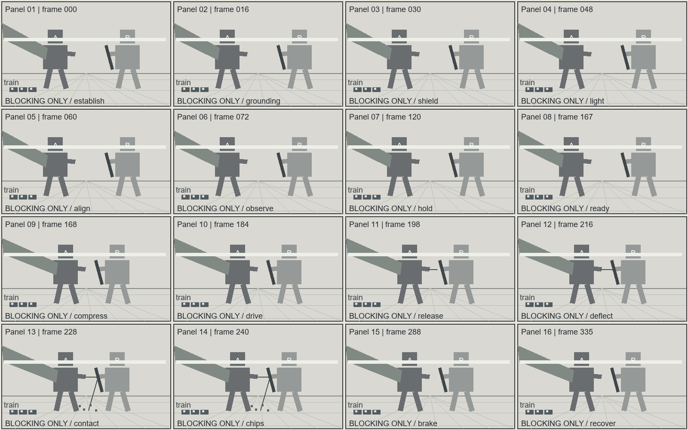

# 超巨构神魔对决｜港湾守线

状态：完整生产卡及提示词已编译；图像仅有随包灰模构图示意，未调用影视生成模型。

- 总时长：14 秒；最大生成窗：14 秒；24 fps。
- 数据真值源：[03-colossal.production.json](03-colossal.production.json)。
- 声音：现场音；非叙事配乐 N/A。

## 剧情与人物选择

港湾中的两座巨体以列车和云带确立尺度。Aer释放一道刃形能量，石哨兵用盾臂把冲击导离列车。盾肋与海墙表层受损，交通承重结构保持，双方带着真实代价进入下一轮。

A：能量是否越过防线。
B：防守者优先保护列车而非自身盾臂。
C：地形承托和导流机制共同限制巨体行动。

## 登记场景与人物

```json
{
  "scenes": [
    {
      "id": "S01",
      "name": "港湾堤道",
      "space": "Harbor shelf, train platform, sea-wall and warehouse skyline",
      "version": "v1",
      "entrances": [
        "west service route"
      ],
      "exits": [
        "east service route"
      ],
      "landmarks": [
        "Harbor shelf, train platform, sea-wall and warehouse skyline"
      ],
      "key_light": "fixed world-east source",
      "prompt_description": "A harbor shelf faces a sea wall, with a train causeway and warehouses behind it."
    }
  ],
  "characters": [
    {
      "id": "CHAR_AER",
      "name": "Aer",
      "height_m": 180,
      "identity": "Original design; appearance defined by the production prose, not by a franchise reference",
      "prompt_description": "Aer is a 180-meter bronze guardian with broad wings and a forearm blade channel."
    },
    {
      "id": "CHAR_GUARDIAN",
      "name": "Stone Sentinel",
      "height_m": 160,
      "identity": "Original design; appearance defined by the production prose, not by a franchise reference",
      "prompt_description": "The Stone Sentinel is a 160-meter dark stone guardian with a ribbed shield forearm."
    }
  ]
}
```

## 逐镜生产卡

### FILM-S01-SH001｜0.000–7.000 秒

Aer stands left, facing the sentinel across the water. Its left wing extends beyond frame. Low east sunlight defines broad shadow masses.

```json
{
  "id": "FILM-S01-SH001",
  "scene_id": "S01",
  "start_frame": 0,
  "end_frame": 168,
  "visual": "Aer stands left, facing the sentinel across the water. Its left wing extends beyond frame. Low east sunlight defines broad shadow masses.",
  "camera": {
    "previs_id": "084",
    "lens_mm": 50,
    "sensor_basis": "full-frame equivalent",
    "shutter_angle": 180,
    "movement": "slow controlled pull",
    "path": "slow backward travel along the causeway observation platform",
    "target": "the visible action and contact plane",
    "adaptation": "project-specific amplitude and speed; source ID is a motion-family reference",
    "description": "The camera slowly pulls back along the causeway, retaining the train, ankle platform and harbor horizon."
  },
  "characters": [
    {
      "id": "CHAR_AER",
      "position": [
        0.32,
        0.55
      ],
      "facing": "toward screen right",
      "gaze": "toward Stone Sentinel",
      "weapon_hand": "forearm blade channel",
      "weapon_direction": "toward the established contact line"
    },
    {
      "id": "CHAR_GUARDIAN",
      "position": [
        0.74,
        0.55
      ],
      "facing": "toward screen left",
      "gaze": "toward Aer",
      "weapon_hand": "ribbed shield forearm",
      "weapon_direction": "toward the established contact line"
    }
  ],
  "features": {
    "core_emotion": false,
    "combat": false,
    "supernatural_vfx": false,
    "colossal": true
  },
  "dialogues": [],
  "audio": {
    "foley": [
      "Train wheels click along the causeway under wind and harbor water."
    ],
    "low_frequency_hz": 35,
    "classification": "audible_sub_bass",
    "source": "designed ground-coupled resonance at the harbor wall"
  },
  "outcome_events": [],
  "state_in": {
    "characters": {
      "CHAR_AER": {
        "ammo": 2,
        "trauma_phase": null
      },
      "CHAR_GUARDIAN": {
        "ammo": 0,
        "trauma_phase": null
      }
    },
    "scenes": {
      "S01": 0
    },
    "props": {
      "STONE_SHIELD": "CHAR_GUARDIAN"
    }
  },
  "state_out": {
    "characters": {
      "CHAR_AER": {
        "ammo": 2,
        "trauma_phase": null
      },
      "CHAR_GUARDIAN": {
        "ammo": 0,
        "trauma_phase": null
      }
    },
    "scenes": {
      "S01": 0
    },
    "props": {
      "STONE_SHIELD": "CHAR_GUARDIAN"
    }
  },
  "scale_proofs": [
    {
      "type": "benchmark",
      "detail": "Ankle and train share depth; one armor joint spans several carriage doors.",
      "frame_location": "lower-left causeway",
      "depth_relation": "train and ankle share the same ground plane"
    },
    {
      "type": "environment",
      "detail": "Wing pressure pushes waves; its shadow spans warehouses.",
      "frame_location": "harbor midground and opposite shore",
      "depth_relation": "wave and shadow connect the guardian to the distant port"
    },
    {
      "type": "atmosphere",
      "detail": "Clouds cross the torso, lowering head contrast while leaving the legs clear.",
      "frame_location": "upper torso",
      "depth_relation": "cloud layer sits between camera and upper body"
    }
  ],
  "state_description": "The train route is clear and the shield rib intact."
}
```

### FILM-S01-SH002｜7.000–14.000 秒

Aer braces on the harbor shelf. The sentinel keeps its base against the sea wall, with the maintenance train outside the contact zone.

```json
{
  "id": "FILM-S01-SH002",
  "scene_id": "S01",
  "start_frame": 168,
  "end_frame": 336,
  "visual": "Aer braces on the harbor shelf. The sentinel keeps its base against the sea wall, with the maintenance train outside the contact zone.",
  "camera": {
    "previs_id": "039",
    "lens_mm": 70,
    "sensor_basis": "full-frame equivalent",
    "shutter_angle": 180,
    "movement": "slow controlled lateral translation",
    "path": "lateral tracking along the original safe side of the harbor wall",
    "target": "the visible action and contact plane",
    "adaptation": "project-specific amplitude and speed; source ID is a motion-family reference",
    "description": "The camera tracks parallel to the harbor wall, holding the shield contact and the ground reference in the same medium-wide view."
  },
  "characters": [
    {
      "id": "CHAR_AER",
      "position": [
        0.38,
        0.55
      ],
      "facing": "toward screen right",
      "gaze": "toward Stone Sentinel",
      "weapon_hand": "forearm blade channel",
      "weapon_direction": "toward the established contact line"
    },
    {
      "id": "CHAR_GUARDIAN",
      "position": [
        0.68,
        0.55
      ],
      "facing": "toward screen left",
      "gaze": "toward Aer",
      "weapon_hand": "ribbed shield forearm",
      "weapon_direction": "toward the established contact line"
    }
  ],
  "features": {
    "core_emotion": false,
    "combat": true,
    "supernatural_vfx": true,
    "colossal": true
  },
  "dialogues": [],
  "audio": {
    "foley": [
      "A delayed stone resonance follows the visible contact, with wind and harbor water continuing underneath."
    ],
    "low_frequency_hz": 35,
    "classification": "audible_sub_bass",
    "source": "designed ground-coupled resonance at the harbor wall"
  },
  "outcome_events": [
    "EV_PULSE",
    "EV_WALL",
    "EV_SHIELD"
  ],
  "state_in": {
    "characters": {
      "CHAR_AER": {
        "ammo": 2,
        "trauma_phase": null
      },
      "CHAR_GUARDIAN": {
        "ammo": 0,
        "trauma_phase": null
      }
    },
    "scenes": {
      "S01": 0
    },
    "props": {
      "STONE_SHIELD": "CHAR_GUARDIAN"
    }
  },
  "state_out": {
    "characters": {
      "CHAR_AER": {
        "ammo": 1,
        "trauma_phase": null
      },
      "CHAR_GUARDIAN": {
        "ammo": 0,
        "trauma_phase": 0
      }
    },
    "scenes": {
      "S01": 2
    },
    "props": {
      "STONE_SHIELD": "CHAR_GUARDIAN"
    }
  },
  "scale_proofs": [
    {
      "type": "benchmark",
      "detail": "Ankle and train share depth; one armor joint spans several carriage doors.",
      "frame_location": "lower-left causeway",
      "depth_relation": "train and ankle share the same ground plane"
    },
    {
      "type": "environment",
      "detail": "Wing pressure pushes waves; its shadow spans warehouses.",
      "frame_location": "harbor midground and opposite shore",
      "depth_relation": "wave and shadow connect the guardian to the distant port"
    }
  ],
  "combat": {
    "force_source": "Aer's planted foot drives torso rotation into the shoulder.",
    "trajectory": "The stream arcs downward toward the raised forearm.",
    "contact": "Its narrow leading edge meets the shield's outer stone rib.",
    "resistance": "Layered stone resists compression before its outer rib flakes away.",
    "impact_hold": "The contact outline holds for two planned frames; clouds continue drifting.",
    "transfer": "The retreating forearm transmits load through the torso into the sea-wall brace.",
    "recoil": "Aer lowers its wing and bends the planted knee to brake rotation.",
    "chain": {
      "attack": "Aer sends one blade-shaped pulse toward the shield.",
      "response": "The sentinel turns the shield to guide the pulse away from the train.",
      "result": "The shield rib sheds stone flakes and the sea-wall surface cracks without collapsing the causeway.",
      "continuation": "Both giants remain supported; the sentinel's damaged shield stays raised for the next exchange."
    },
    "timing": {
      "axis_lock": "Keep the established left-right axis: the attacker remains on screen left and the defender on screen right; do not cross the 180-degree line during the exchange.",
      "spatial_direction": "Aer attacks from screen left toward the sentinel on screen right; the shield turns the pulse down and away from the train, preserving the harbor support line.",
      "speed_curve": "Use fast readable approach, a brief compressed commitment, a precisely readable contact beat, then a longer real-time recovery; never insert a decorative slow-motion pause between unrelated actions.",
      "camera_sync": "The camera tracks parallel to the action line, keeps the feet, weapon path and contact plane visible, and eases only after the defender's result is readable.",
      "direction_facts": {
        "origin": "The attack begins at the declared planted foot, hand or mounted weapon.",
        "target": "The declared defender or environmental target receives the action.",
        "screen_direction": "Aer attacks from screen left toward the sentinel on screen right; the shield turns the pulse down and away from the train, preserving the harbor support line.",
        "body_orientation": "The attacker faces the target and the defender faces the attacker without an unexplained turn.",
        "weapon_direction": "The active limb, weapon or emitted object follows the declared contact line.",
        "support_point": "The declared planted foot, hand, ground or structural brace carries the force.",
        "result_direction": "The result travels along the declared deflection, recoil or displacement line."
      },
      "speed_profile": {
        "support": "Establish the planted support and readable distance before acceleration.",
        "acceleration": "Accelerate from the support through the body into the weapon or action path.",
        "contact_read": "Compress only the single contact and first material response so the force direction is readable.",
        "recovery": "Return to real time for recoil, displacement, braking and the inherited tail state."
      },
      "phases": [
        {
          "name": "approach",
          "start": 0,
          "end": 24,
          "playback": "real_time",
          "purpose": "the planted support and target line must be established before acceleration",
          "motion": "the attacker compresses the support leg and the defender raises the readable defense without changing sides",
          "positions": "The attacker remains on screen left and the defender on screen right during the approach beat, with the established landmark visible.",
          "orientation": "The attacker faces the defender and the defender faces the attacker throughout approach; both gazes stay on the active line.",
          "action": "The approach action follows the declared support, target and result direction without a teleport or axis flip.",
          "combat_logic": {
            "attacker": "The registered attacker or its active weapon owns this beat.",
            "target": "The registered defender or stated environmental target receives the action.",
            "target_point": "The declared contact surface or target point remains specific and visible.",
            "intent": "The tactical purpose is to complete the approach beat of the exchange.",
            "defender_state": "The defender begins from the inherited balance, guard and support state.",
            "response": "The defender responds along the declared line with a visible physical cause.",
            "result": "The immediate approach result is visible before the next phase begins.",
            "next_authority": "The next phase starts from this held pose and its stated active side."
          },
          "camera": {
            "framing": "The camera framing keeps both bodies, the active line and the approach anchor readable.",
            "movement": "The camera uses a controlled approach movement with amplitude and speed matched to the action.",
            "motion_vector": "The camera vector supports the declared attack, defense and result vectors without crossing the axis.",
            "action_anchor": "The camera follows the visible approach anchor: support, weapon path, contact, recoil or settled guard."
          },
          "dof": "Focus stays on the approach anchor and transfers only when the next physical result becomes readable.",
          "composition": "The left-right axis, depth landmark and protected movement exit remain visible.",
          "dynamics": "Environmental response remains subordinate during approach and follows the same force direction.",
          "tail_frame": "The approach phase ends with an explicit inherited distance, facing, weapon state and gaze."
        },
        {
          "name": "commit",
          "start": 24,
          "end": 60,
          "playback": "ramped",
          "purpose": "the attack must gain speed from a visible body-driven initiation",
          "motion": "the hip and shoulder drive the weapon or energy from screen left toward the defender's stated target point",
          "positions": "The attacker remains on screen left and the defender on screen right during the commitment beat, with the established landmark visible.",
          "orientation": "The attacker faces the defender and the defender faces the attacker throughout commitment; both gazes stay on the active line.",
          "action": "The commitment action follows the declared support, target and result direction without a teleport or axis flip.",
          "combat_logic": {
            "attacker": "The registered attacker or its active weapon owns this beat.",
            "target": "The registered defender or stated environmental target receives the action.",
            "target_point": "The declared contact surface or target point remains specific and visible.",
            "intent": "The tactical purpose is to complete the commitment beat of the exchange.",
            "defender_state": "The defender begins from the inherited balance, guard and support state.",
            "response": "The defender responds along the declared line with a visible physical cause.",
            "result": "The immediate commitment result is visible before the next phase begins.",
            "next_authority": "The next phase starts from this held pose and its stated active side."
          },
          "camera": {
            "framing": "The camera framing keeps both bodies, the active line and the commitment anchor readable.",
            "movement": "The camera uses a controlled commitment movement with amplitude and speed matched to the action.",
            "motion_vector": "The camera vector supports the declared attack, defense and result vectors without crossing the axis.",
            "action_anchor": "The camera follows the visible commitment anchor: support, weapon path, contact, recoil or settled guard."
          },
          "dof": "Focus stays on the commitment anchor and transfers only when the next physical result becomes readable.",
          "composition": "The left-right axis, depth landmark and protected movement exit remain visible.",
          "dynamics": "Environmental response remains subordinate during commitment and follows the same force direction.",
          "tail_frame": "The commitment phase ends with an explicit inherited distance, facing, weapon state and gaze."
        },
        {
          "name": "contact",
          "start": 60,
          "end": 62,
          "playback": "slow_motion",
          "purpose": "the contact surface, direction of deflection and first material response must be legible",
          "motion": "the leading edge meets the defense, holds its silhouette for two frames, and begins to turn along the deflection plane",
          "positions": "The attacker remains on screen left and the defender on screen right during the contact beat, with the established landmark visible.",
          "orientation": "The attacker faces the defender and the defender faces the attacker throughout contact; both gazes stay on the active line.",
          "action": "The contact action follows the declared support, target and result direction without a teleport or axis flip.",
          "combat_logic": {
            "attacker": "The registered attacker or its active weapon owns this beat.",
            "target": "The registered defender or stated environmental target receives the action.",
            "target_point": "The declared contact surface or target point remains specific and visible.",
            "intent": "The tactical purpose is to complete the contact beat of the exchange.",
            "defender_state": "The defender begins from the inherited balance, guard and support state.",
            "response": "The defender responds along the declared line with a visible physical cause.",
            "result": "The immediate contact result is visible before the next phase begins.",
            "next_authority": "The next phase starts from this held pose and its stated active side."
          },
          "camera": {
            "framing": "The camera framing keeps both bodies, the active line and the contact anchor readable.",
            "movement": "The camera uses a controlled contact movement with amplitude and speed matched to the action.",
            "motion_vector": "The camera vector supports the declared attack, defense and result vectors without crossing the axis.",
            "action_anchor": "The camera follows the visible contact anchor: support, weapon path, contact, recoil or settled guard."
          },
          "dof": "Focus stays on the contact anchor and transfers only when the next physical result becomes readable.",
          "composition": "The left-right axis, depth landmark and protected movement exit remain visible.",
          "dynamics": "Environmental response remains subordinate during contact and follows the same force direction.",
          "tail_frame": "The contact phase ends with an explicit inherited distance, facing, weapon state and gaze."
        },
        {
          "name": "recovery",
          "start": 62,
          "end": 120,
          "playback": "real_time",
          "purpose": "the result must propagate through both bodies and the environment",
          "motion": "the defender yields along the declared line while the attacker absorbs recoil instead of teleporting to a new stance",
          "positions": "The attacker remains on screen left and the defender on screen right during the recovery beat, with the established landmark visible.",
          "orientation": "The attacker faces the defender and the defender faces the attacker throughout recovery; both gazes stay on the active line.",
          "action": "The recovery action follows the declared support, target and result direction without a teleport or axis flip.",
          "combat_logic": {
            "attacker": "The registered attacker or its active weapon owns this beat.",
            "target": "The registered defender or stated environmental target receives the action.",
            "target_point": "The declared contact surface or target point remains specific and visible.",
            "intent": "The tactical purpose is to complete the recovery beat of the exchange.",
            "defender_state": "The defender begins from the inherited balance, guard and support state.",
            "response": "The defender responds along the declared line with a visible physical cause.",
            "result": "The immediate recovery result is visible before the next phase begins.",
            "next_authority": "The next phase starts from this held pose and its stated active side."
          },
          "camera": {
            "framing": "The camera framing keeps both bodies, the active line and the recovery anchor readable.",
            "movement": "The camera uses a controlled recovery movement with amplitude and speed matched to the action.",
            "motion_vector": "The camera vector supports the declared attack, defense and result vectors without crossing the axis.",
            "action_anchor": "The camera follows the visible recovery anchor: support, weapon path, contact, recoil or settled guard."
          },
          "dof": "Focus stays on the recovery anchor and transfers only when the next physical result becomes readable.",
          "composition": "The left-right axis, depth landmark and protected movement exit remain visible.",
          "dynamics": "Environmental response remains subordinate during recovery and follows the same force direction.",
          "tail_frame": "The recovery phase ends with an explicit inherited distance, facing, weapon state and gaze."
        },
        {
          "name": "reset",
          "start": 120,
          "end": 168,
          "playback": "real_time",
          "purpose": "the next beat needs a stable inherited distance and active side",
          "motion": "both bodies settle into the declared tail state with weapons, feet and gaze still aligned",
          "positions": "The attacker remains on screen left and the defender on screen right during the reset beat, with the established landmark visible.",
          "orientation": "The attacker faces the defender and the defender faces the attacker throughout reset; both gazes stay on the active line.",
          "action": "The reset action follows the declared support, target and result direction without a teleport or axis flip.",
          "combat_logic": {
            "attacker": "The registered attacker or its active weapon owns this beat.",
            "target": "The registered defender or stated environmental target receives the action.",
            "target_point": "The declared contact surface or target point remains specific and visible.",
            "intent": "The tactical purpose is to complete the reset beat of the exchange.",
            "defender_state": "The defender begins from the inherited balance, guard and support state.",
            "response": "The defender responds along the declared line with a visible physical cause.",
            "result": "The immediate reset result is visible before the next phase begins.",
            "next_authority": "The next phase starts from this held pose and its stated active side."
          },
          "camera": {
            "framing": "The camera framing keeps both bodies, the active line and the reset anchor readable.",
            "movement": "The camera uses a controlled reset movement with amplitude and speed matched to the action.",
            "motion_vector": "The camera vector supports the declared attack, defense and result vectors without crossing the axis.",
            "action_anchor": "The camera follows the visible reset anchor: support, weapon path, contact, recoil or settled guard."
          },
          "dof": "Focus stays on the reset anchor and transfers only when the next physical result becomes readable.",
          "composition": "The left-right axis, depth landmark and protected movement exit remain visible.",
          "dynamics": "Environmental response remains subordinate during reset and follows the same force direction.",
          "tail_frame": "The reset phase ends with an explicit inherited distance, facing, weapon state and gaze."
        }
      ],
      "slow_motion": {
        "enabled": true,
        "start": 60,
        "end": 62,
        "rate": 0.5,
        "trigger": "the weapon or energy visibly reaches the defense surface",
        "reason": "the audience must read the single contact and deflection rather than a generic flash",
        "exit": "restore real-time motion immediately after the contact silhouette and first material response are clear"
      }
    }
  },
  "vfx": {
    "origin": "Aer's registered forearm blade channel",
    "backbone": "A thin blade-shaped luminous fluid remains attached to Aer's forearm channel before its leading section strikes the shield rib.",
    "collision_type": "impact",
    "collision": "The outer stone rib flakes at the contact line; the sea-wall surface cracks but its load-bearing base remains intact.",
    "particles": {
      "solid": {
        "present": true,
        "description": "Broad stone flakes separate only from the damaged rib and drop toward the harbor edge."
      },
      "gas": {
        "present": true,
        "description": "A low dust plume follows the shield surface and thins across the water."
      },
      "emissive": {
        "present": true,
        "description": "Sparse amber light points detach from the fluid edge and extinguish within the contact region."
      }
    },
    "lighting": "A narrow white contact line fades to soft amber edges against blue-gray shadow; the east sun remains the dominant world source.",
    "phases": [
      {
        "name": "anticipation",
        "start": 0,
        "end": 24
      },
      {
        "name": "release",
        "start": 24,
        "end": 60
      },
      {
        "name": "impact",
        "start": 60,
        "end": 62
      },
      {
        "name": "decay",
        "start": 62,
        "end": 168
      }
    ]
  },
  "state_description": "The train route is clear and the shield rib intact."
}
```

## GPT Image 2 / 2.5 可直接复制提示词

按主体、媒介、构图、光材、密度、受控细节、当前风险顺序编译。执行尺寸和采样设置留给实际出图入口。

参考图：必须上传下列文件；只继承明确列出的用途。

- Reference image 1：[上传该图](media/colossal-contact.png)；用途：composition；保留：only Panel 01's left-right placement and ground line; the left block marked A denotes Aer, and the right block marked B denotes Stone Sentinel；不继承：the grid, letters, panel numbers, gray block anatomy and flat diagram shading; produce one full-frame image。

```text
Reference image 1 supplies composition guidance for the confrontation between Aer and Stone Sentinel. Preserve only Panel 01's left-right placement and ground line; the left block marked A denotes Aer, and the right block marked B denotes Stone Sentinel. Do not inherit the grid, letters, panel numbers, gray block anatomy and flat diagram shading; produce one full-frame image.

Create one cel-shaded harbor confrontation keyframe with a 180-meter winged bronze guardian at left and a 160-meter stone sentinel at right. The maintenance train touches the guardian's ankle platform at the same depth, while a cloud shelf crosses the upper torso and the wing shadow spans multiple warehouse roofs. Keep one clear vertical silhouette and let the left wing leave the frame. Use a distant causeway observer and a 50 mm equivalent lens; retain the harbor horizon and usable railway route. Low east sunlight defines three large value masses. Bronze panels receive narrow directional highlights, the intact stone shield ribs show broad matte planes and clear edge thickness. The train doors remain legible scale modules; distant roof details merge into lower-contrast atmosphere. Capture the grounded opening stance before the attack; the forearm channel is unlit and no energy has been emitted. Avoid miniature tilt-shift blur, repeated ornamental texture and disconnected load-bearing structure.
```

## COLOSSAL_SEG01｜16格逐项映射



灰模不代表最终外貌、材质或准确摄影轨迹。

| Panel | Shot | 全局帧 | 单相位 |
|---|---|---:|---|
| 01 | FILM-S01-SH001 | 0 | Train and guardian ankle share a depth plane. |
| 02 | FILM-S01-SH001 | 16 | The wing extends beyond the left frame edge. |
| 03 | FILM-S01-SH001 | 30 | The cloud shelf crosses the upper torso. |
| 04 | FILM-S01-SH001 | 48 | A broad shadow crosses warehouses. |
| 05 | FILM-S01-SH001 | 60 | The sentinel holds the opposing shore. |
| 06 | FILM-S01-SH001 | 72 | The water between both bodies remains visible. |
| 07 | FILM-S01-SH001 | 120 | Aer lowers its foot onto the shelf. |
| 08 | FILM-S01-SH001 | 167 | The forearm channel aligns with the shield. |
| 09 | FILM-S01-SH002 | 168 | Aer compresses its planted leg. |
| 10 | FILM-S01-SH002 | 184 | The torso transfers load to the shoulder. |
| 11 | FILM-S01-SH002 | 198 | A blade-shaped fluid pulse extends. |
| 12 | FILM-S01-SH002 | 216 | The sentinel rotates its stone forearm. |
| 13 | FILM-S01-SH002 | 228 | The shield rib receives the readable contact. |
| 14 | FILM-S01-SH002 | 240 | Stone flakes leave the shield rib. |
| 15 | FILM-S01-SH002 | 288 | The wall facing cracks above its support. |
| 16 | FILM-S01-SH002 | 335 | Both giants recover while the cloud layer moves. |

## COLOSSAL_SEG01｜H3 Ref2VA 完整提示词

```text
subject_definitions:
<Picture 1> is the sixteen-panel gray blocking diagram for [Shot 1] and [Shot 2], providing left-right placement and event order; its schematic figures and flat shading are not appearance or material references.

summary:
[reference generation] The target video follows the blocking and order in <Picture 1>, first establishing the confrontation and then showing the attack, defense, material response and continuing recovery.

retention_analysis:
<Picture 1> (planning reference for [Shot 1] and [Shot 2]): weak_reference - preserve the two figures' relative sides and the ordered action beats, while replacing schematic blocks with the described original character designs in a single full-screen view.

detailed_description:
The sequence uses large cel-shaded forms, selective painted atmosphere and restrained luminous edges.
This is a self-contained production instruction and must be readable without the production file, an earlier segment, or a hidden character bible. For every shot, explicitly state: the medium and visible subject appearance, screen position and facing; the current environment, landmarks and light direction; the exact starting pose, prop ownership, contact points and state; the factual trigger for each change; the chronological action, reaction and physical consequence; the camera framing, lens, movement type, direction, path, amplitude, speed and target; the source and timing of dialogue, foley, room tone and breath; the exact held state at the end and what can continue into the next shot. Render objective, social strategy and subtext as observable gaze, breath, posture, hand, facial and voice behavior. Keep cause and effect physically, spatially, temporally and socially coherent. Do not replace a visible action with a vague adjective, skip the transition between beats, collapse preparation, accent, follow-through or settle into one verb, or invent dialogue, objects, voices, cuts or state changes that are not written below.
[Shot 1] Write this shot as a complete independent instruction: restate who is visible and where they are, the environment and light, the start state, the trigger, the ordered action and reaction, the camera path and speed, synchronized sound, and the resulting held state. Aer is a 180-meter bronze guardian with broad wings and a forearm blade channel. The Stone Sentinel is a 160-meter dark stone guardian with a ribbed shield forearm. A harbor shelf faces a sea wall, with a train causeway and warehouses behind it. At the start of this shot: The train route is clear and the shield rib intact. From 0.000 to 7.000 seconds of this request, <Picture 1> is the sixteen-panel gray blocking diagram for [Shot 1] and [Shot 2], providing left-right placement and event order; its schematic figures and flat shading are not appearance or material references. Preserve only: <Picture 1> (planning reference for [Shot 1] and [Shot 2]): weak_reference - preserve the two figures' relative sides and the ordered action beats, while replacing schematic blocks with the described original character designs in a single full-screen view.. Aer stands left, facing the sentinel across the water. Its left wing extends beyond frame. Low east sunlight defines broad shadow masses. The camera slowly pulls back along the causeway, retaining the train, ankle platform and harbor horizon. The camera uses a 50 mm lens under the full-frame equivalent convention, with a 180-degree shutter-angle convention; movement: slow controlled pull; path: slow backward travel along the causeway observation platform; target: the visible action and contact plane. At shot entry, Aer has normalized screen anchor x=0.32, y=0.55 (left-to-right and top-to-bottom); facing toward screen right; gaze toward Stone Sentinel; hand or weapon state: forearm blade channel; weapon direction or absence: toward the established contact line. At shot entry, Stone Sentinel has normalized screen anchor x=0.74, y=0.55 (left-to-right and top-to-bottom); facing toward screen left; gaze toward Aer; hand or weapon state: ribbed shield forearm; weapon direction or absence: toward the established contact line. Ankle and train share depth; one armor joint spans several carriage doors. Visible at lower-left causeway; depth relationship: train and ankle share the same ground plane. Wing pressure pushes waves; its shadow spans warehouses. Visible at harbor midground and opposite shore; depth relationship: wave and shadow connect the guardian to the distant port. Clouds cross the torso, lowering head contrast while leaving the legs clear. Visible at upper torso; depth relationship: cloud layer sits between camera and upper body. Train wheels click along the causeway under wind and harbor water. The designed low-frequency cue is 35 Hz, sourced from designed ground-coupled resonance at the harbor wall. The shot develops the blocking in <Picture 1> Panels 01–08. At the end of this shot, carry forward these recorded constraints: Aer retains 2 recorded ammunition or energy units; the stone shield remains with Stone Sentinel.
[Shot 2] At 00:07.000, the camera cuts to the following view. Write this shot as a complete independent instruction: restate who is visible and where they are, the environment and light, the start state, the trigger, the ordered action and reaction, the camera path and speed, synchronized sound, and the resulting held state. Aer is a 180-meter bronze guardian with broad wings and a forearm blade channel. The Stone Sentinel is a 160-meter dark stone guardian with a ribbed shield forearm. A harbor shelf faces a sea wall, with a train causeway and warehouses behind it. At the start of this shot: The train route is clear and the shield rib intact. From 7.000 to 14.000 seconds of this request, <Picture 1> is the sixteen-panel gray blocking diagram for [Shot 1] and [Shot 2], providing left-right placement and event order; its schematic figures and flat shading are not appearance or material references. Preserve only: <Picture 1> (planning reference for [Shot 1] and [Shot 2]): weak_reference - preserve the two figures' relative sides and the ordered action beats, while replacing schematic blocks with the described original character designs in a single full-screen view.. Aer braces on the harbor shelf. The sentinel keeps its base against the sea wall, with the maintenance train outside the contact zone. The camera tracks parallel to the harbor wall, holding the shield contact and the ground reference in the same medium-wide view. The camera uses a 70 mm lens under the full-frame equivalent convention, with a 180-degree shutter-angle convention; movement: slow controlled lateral translation; path: lateral tracking along the original safe side of the harbor wall; target: the visible action and contact plane. At shot entry, Aer has normalized screen anchor x=0.38, y=0.55 (left-to-right and top-to-bottom); facing toward screen right; gaze toward Stone Sentinel; hand or weapon state: forearm blade channel; weapon direction or absence: toward the established contact line. At shot entry, Stone Sentinel has normalized screen anchor x=0.68, y=0.55 (left-to-right and top-to-bottom); facing toward screen left; gaze toward Aer; hand or weapon state: ribbed shield forearm; weapon direction or absence: toward the established contact line. Aer's planted foot drives torso rotation into the shoulder. Aer sends one blade-shaped pulse toward the shield. The stream arcs downward toward the raised forearm. The sentinel turns the shield to guide the pulse away from the train. Its narrow leading edge meets the shield's outer stone rib. Layered stone resists compression before its outer rib flakes away. The contact outline holds for two planned frames; clouds continue drifting. The retreating forearm transmits load through the torso into the sea-wall brace. Aer's registered forearm blade channel A thin blade-shaped luminous fluid remains attached to Aer's forearm channel before its leading section strikes the shield rib. Broad stone flakes separate only from the damaged rib and drop toward the harbor edge. A low dust plume follows the shield surface and thins across the water. Sparse amber light points detach from the fluid edge and extinguish within the contact region. The outer stone rib flakes at the contact line; the sea-wall surface cracks but its load-bearing base remains intact. A narrow white contact line fades to soft amber edges against blue-gray shadow; the east sun remains the dominant world source. Within this shot, the effect follows anticipation 0.000–1.000s; release 1.000–2.500s; impact 2.500–2.583s; decay 2.583–7.000s. The shield rib sheds stone flakes and the sea-wall surface cracks without collapsing the causeway. Aer lowers its wing and bends the planted knee to brake rotation. Both giants remain supported; the sentinel's damaged shield stays raised for the next exchange. Combat direction lock: Keep the established left-right axis: the attacker remains on screen left and the defender on screen right; do not cross the 180-degree line during the exchange. Spatial direction: Aer attacks from screen left toward the sentinel on screen right; the shield turns the pulse down and away from the train, preserving the harbor support line. Speed curve: Use fast readable approach, a brief compressed commitment, a precisely readable contact beat, then a longer real-time recovery; never insert a decorative slow-motion pause between unrelated actions. Camera and action synchronization: The camera tracks parallel to the action line, keeps the feet, weapon path and contact plane visible, and eases only after the defender's result is readable. Direction facts: origin = The attack begins at the declared planted foot, hand or mounted weapon; target = The declared defender or environmental target receives the action; screen direction = Aer attacks from screen left toward the sentinel on screen right; the shield turns the pulse down and away from the train, preserving the harbor support line; body orientation = The attacker faces the target and the defender faces the attacker without an unexplained turn; weapon direction = The active limb, weapon or emitted object follows the declared contact line; support point = The declared planted foot, hand, ground or structural brace carries the force; result direction = The result travels along the declared deflection, recoil or displacement line. Speed profile: support = Establish the planted support and readable distance before acceleration; acceleration = Accelerate from the support through the body into the weapon or action path; contact read = Compress only the single contact and first material response so the force direction is readable; recovery = Return to real time for recoil, displacement, braking and the inherited tail state. From 0.000 to 1.000 seconds, the approach phase uses real_time playback because the planted support and target line must be established before acceleration; motion: the attacker compresses the support leg and the defender raises the readable defense without changing sides. Positions: The attacker remains on screen left and the defender on screen right during the approach beat, with the established landmark visible. Orientation: The attacker faces the defender and the defender faces the attacker throughout approach; both gazes stay on the active line. Action: The approach action follows the declared support, target and result direction without a teleport or axis flip. Combat logic: attacker The registered attacker or its active weapon owns this beat; target The registered defender or stated environmental target receives the action; target point The declared contact surface or target point remains specific and visible; intent The tactical purpose is to complete the approach beat of the exchange; defender starts The defender begins from the inherited balance, guard and support state; response The defender responds along the declared line with a visible physical cause; result The immediate approach result is visible before the next phase begins; next authority The next phase starts from this held pose and its stated active side. Camera framing: The camera framing keeps both bodies, the active line and the approach anchor readable; movement: The camera uses a controlled approach movement with amplitude and speed matched to the action; motion vector: The camera vector supports the declared attack, defense and result vectors without crossing the axis; action anchor: The camera follows the visible approach anchor: support, weapon path, contact, recoil or settled guard. DOF: Focus stays on the approach anchor and transfers only when the next physical result becomes readable. Composition: The left-right axis, depth landmark and protected movement exit remain visible. Dynamics: Environmental response remains subordinate during approach and follows the same force direction. Tail frame: The approach phase ends with an explicit inherited distance, facing, weapon state and gaze. From 1.000 to 2.500 seconds, the commit phase uses ramped playback because the attack must gain speed from a visible body-driven initiation; motion: the hip and shoulder drive the weapon or energy from screen left toward the defender's stated target point. Positions: The attacker remains on screen left and the defender on screen right during the commitment beat, with the established landmark visible. Orientation: The attacker faces the defender and the defender faces the attacker throughout commitment; both gazes stay on the active line. Action: The commitment action follows the declared support, target and result direction without a teleport or axis flip. Combat logic: attacker The registered attacker or its active weapon owns this beat; target The registered defender or stated environmental target receives the action; target point The declared contact surface or target point remains specific and visible; intent The tactical purpose is to complete the commitment beat of the exchange; defender starts The defender begins from the inherited balance, guard and support state; response The defender responds along the declared line with a visible physical cause; result The immediate commitment result is visible before the next phase begins; next authority The next phase starts from this held pose and its stated active side. Camera framing: The camera framing keeps both bodies, the active line and the commitment anchor readable; movement: The camera uses a controlled commitment movement with amplitude and speed matched to the action; motion vector: The camera vector supports the declared attack, defense and result vectors without crossing the axis; action anchor: The camera follows the visible commitment anchor: support, weapon path, contact, recoil or settled guard. DOF: Focus stays on the commitment anchor and transfers only when the next physical result becomes readable. Composition: The left-right axis, depth landmark and protected movement exit remain visible. Dynamics: Environmental response remains subordinate during commitment and follows the same force direction. Tail frame: The commitment phase ends with an explicit inherited distance, facing, weapon state and gaze. From 2.500 to 2.583 seconds, the contact phase uses slow_motion playback because the contact surface, direction of deflection and first material response must be legible; motion: the leading edge meets the defense, holds its silhouette for two frames, and begins to turn along the deflection plane. Positions: The attacker remains on screen left and the defender on screen right during the contact beat, with the established landmark visible. Orientation: The attacker faces the defender and the defender faces the attacker throughout contact; both gazes stay on the active line. Action: The contact action follows the declared support, target and result direction without a teleport or axis flip. Combat logic: attacker The registered attacker or its active weapon owns this beat; target The registered defender or stated environmental target receives the action; target point The declared contact surface or target point remains specific and visible; intent The tactical purpose is to complete the contact beat of the exchange; defender starts The defender begins from the inherited balance, guard and support state; response The defender responds along the declared line with a visible physical cause; result The immediate contact result is visible before the next phase begins; next authority The next phase starts from this held pose and its stated active side. Camera framing: The camera framing keeps both bodies, the active line and the contact anchor readable; movement: The camera uses a controlled contact movement with amplitude and speed matched to the action; motion vector: The camera vector supports the declared attack, defense and result vectors without crossing the axis; action anchor: The camera follows the visible contact anchor: support, weapon path, contact, recoil or settled guard. DOF: Focus stays on the contact anchor and transfers only when the next physical result becomes readable. Composition: The left-right axis, depth landmark and protected movement exit remain visible. Dynamics: Environmental response remains subordinate during contact and follows the same force direction. Tail frame: The contact phase ends with an explicit inherited distance, facing, weapon state and gaze. From 2.583 to 5.000 seconds, the recovery phase uses real_time playback because the result must propagate through both bodies and the environment; motion: the defender yields along the declared line while the attacker absorbs recoil instead of teleporting to a new stance. Positions: The attacker remains on screen left and the defender on screen right during the recovery beat, with the established landmark visible. Orientation: The attacker faces the defender and the defender faces the attacker throughout recovery; both gazes stay on the active line. Action: The recovery action follows the declared support, target and result direction without a teleport or axis flip. Combat logic: attacker The registered attacker or its active weapon owns this beat; target The registered defender or stated environmental target receives the action; target point The declared contact surface or target point remains specific and visible; intent The tactical purpose is to complete the recovery beat of the exchange; defender starts The defender begins from the inherited balance, guard and support state; response The defender responds along the declared line with a visible physical cause; result The immediate recovery result is visible before the next phase begins; next authority The next phase starts from this held pose and its stated active side. Camera framing: The camera framing keeps both bodies, the active line and the recovery anchor readable; movement: The camera uses a controlled recovery movement with amplitude and speed matched to the action; motion vector: The camera vector supports the declared attack, defense and result vectors without crossing the axis; action anchor: The camera follows the visible recovery anchor: support, weapon path, contact, recoil or settled guard. DOF: Focus stays on the recovery anchor and transfers only when the next physical result becomes readable. Composition: The left-right axis, depth landmark and protected movement exit remain visible. Dynamics: Environmental response remains subordinate during recovery and follows the same force direction. Tail frame: The recovery phase ends with an explicit inherited distance, facing, weapon state and gaze. From 5.000 to 7.000 seconds, the reset phase uses real_time playback because the next beat needs a stable inherited distance and active side; motion: both bodies settle into the declared tail state with weapons, feet and gaze still aligned. Positions: The attacker remains on screen left and the defender on screen right during the reset beat, with the established landmark visible. Orientation: The attacker faces the defender and the defender faces the attacker throughout reset; both gazes stay on the active line. Action: The reset action follows the declared support, target and result direction without a teleport or axis flip. Combat logic: attacker The registered attacker or its active weapon owns this beat; target The registered defender or stated environmental target receives the action; target point The declared contact surface or target point remains specific and visible; intent The tactical purpose is to complete the reset beat of the exchange; defender starts The defender begins from the inherited balance, guard and support state; response The defender responds along the declared line with a visible physical cause; result The immediate reset result is visible before the next phase begins; next authority The next phase starts from this held pose and its stated active side. Camera framing: The camera framing keeps both bodies, the active line and the reset anchor readable; movement: The camera uses a controlled reset movement with amplitude and speed matched to the action; motion vector: The camera vector supports the declared attack, defense and result vectors without crossing the axis; action anchor: The camera follows the visible reset anchor: support, weapon path, contact, recoil or settled guard. DOF: Focus stays on the reset anchor and transfers only when the next physical result becomes readable. Composition: The left-right axis, depth landmark and protected movement exit remain visible. Dynamics: Environmental response remains subordinate during reset and follows the same force direction. Tail frame: The reset phase ends with an explicit inherited distance, facing, weapon state and gaze. Use slow motion only from 2.500 to 2.583 seconds at 0.5x: trigger it when the weapon or energy visibly reaches the defense surface, because the audience must read the single contact and deflection rather than a generic flash; exit when restore real-time motion immediately after the contact silhouette and first material response are clear. Ankle and train share depth; one armor joint spans several carriage doors. Visible at lower-left causeway; depth relationship: train and ankle share the same ground plane. Wing pressure pushes waves; its shadow spans warehouses. Visible at harbor midground and opposite shore; depth relationship: wave and shadow connect the guardian to the distant port. A delayed stone resonance follows the visible contact, with wind and harbor water continuing underneath. The designed low-frequency cue is 35 Hz, sourced from designed ground-coupled resonance at the harbor wall. The shot develops the blocking in <Picture 1> Panels 09–16. At local shot time 00:01.542, the recorded state change is: One stored pulse leaves the registered blade channel. At local shot time 00:02.500, the recorded state change is: A localized wall facing cracks, but the causeway bearing structure remains usable. At local shot time 00:02.583, the recorded state change is: The sentinel's shield-arm outer rib breaks and remains functionally weakened. At the end of this shot, carry forward these recorded constraints: Aer retains 1 recorded ammunition or energy units; Stone Sentinel remains in the acute injury state; preserve the described functional limitations; the harbor retains local heavy damage with main supports usable; the stone shield remains with Stone Sentinel.

overall_soundscape:
Wind and harbor waves continue beneath a designed 35 Hz ground resonance. Stone impact reaches the observing causeway after the visible contact, with a rolling echo across the water.

non_diegetic_music:
N/A
```

## 场记末尾回写

```json
{
  "initial": {
    "characters": {
      "CHAR_AER": {
        "ammo": 2,
        "trauma_phase": null
      },
      "CHAR_GUARDIAN": {
        "ammo": 0,
        "trauma_phase": null
      }
    },
    "scenes": {
      "S01": 0
    },
    "props": {
      "STONE_SHIELD": "CHAR_GUARDIAN"
    }
  },
  "events": [
    {
      "id": "EV_PULSE",
      "frame": 205,
      "shot_id": "FILM-S01-SH002",
      "domain": "ammo",
      "target": "CHAR_AER",
      "before": 2,
      "after": 1,
      "delta": -1,
      "reason": "One stored pulse leaves the registered blade channel."
    },
    {
      "id": "EV_WALL",
      "frame": 228,
      "shot_id": "FILM-S01-SH002",
      "domain": "damage",
      "target": "S01",
      "before": 0,
      "after": 2,
      "reason": "A localized wall facing cracks, but the causeway bearing structure remains usable."
    },
    {
      "id": "EV_SHIELD",
      "frame": 230,
      "shot_id": "FILM-S01-SH002",
      "domain": "trauma",
      "target": "CHAR_GUARDIAN",
      "before": null,
      "after": 0,
      "reason": "The sentinel's shield-arm outer rib breaks and remains functionally weakened."
    }
  ],
  "final": {
    "characters": {
      "CHAR_AER": {
        "ammo": 1,
        "trauma_phase": null
      },
      "CHAR_GUARDIAN": {
        "ammo": 0,
        "trauma_phase": 0
      }
    },
    "scenes": {
      "S01": 2
    },
    "props": {
      "STONE_SHIELD": "CHAR_GUARDIAN"
    }
  }
}
```

## 结果验收

运行 audit_storyboard_quality.py 检查当前数据。实际生成后逐帧看身份、接触、主光、伤势和道具；音轨核对对白与频谱。未生成时视觉及声学实测保持 UNVERIFIED。
